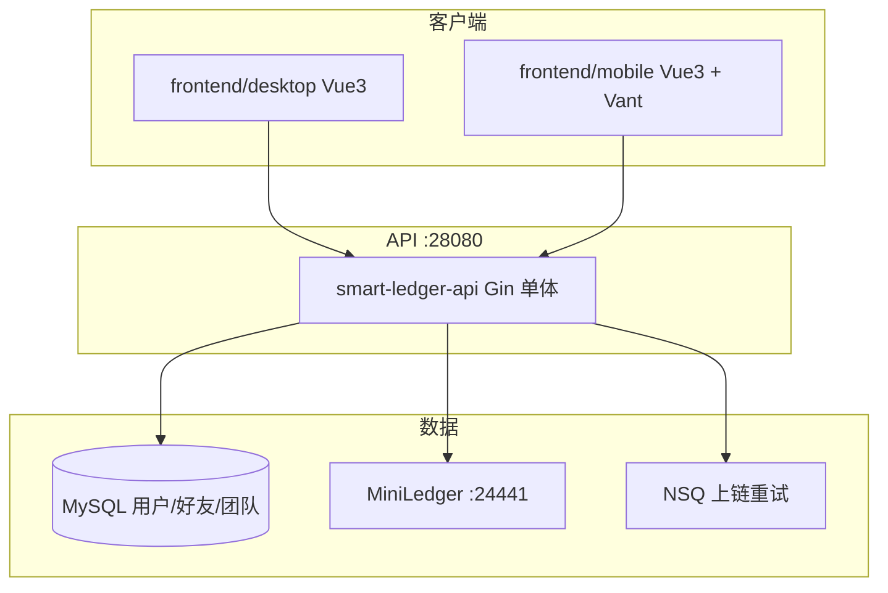

# Smart Ledger（go-Smart-ledger）

去中心化区块链自定义账本系统：支持私人账本与多人账本。  
**权威链**为 [Chainscore MiniLedger](https://github.com/Chainscore/miniledger)。  
后端 **Go（Gin 单体 API）**，前端 **Vue 3** 桌面 + 移动 Web/APK。账本形态为 **简易多 Sheet 工作表**（自定义字段、导入、编辑上链）；专业复式会计模式已移除。

> **维护说明**：每次新增功能或变更规划时，请同步更新本文档——在「项目计划」中登记 idea，并在「已完成 / 未完成」中勾选状态。文末「更新记录」追加一条摘要。

---

## 产品概念：团队 vs 多人账本

| 维度 | **团队（Team）** | **多人账本（Multi Ledger）** |
|------|------------------|------------------------------|
| 本质 | **用户集合体**，协作入口，类似 QQ 群 / 企业微信群 | **记账工具**，链上事件溯源与封账锚定的数据容器 |
| 成员关系 | 团队 `team_members`：好友编组，便于发现「和谁一起干活」 | 账本 `members`：经 **邀请 → 对方同意** 后才有权读写 |
| 与账本关系 | **一个团队可关联多个账本**（快捷入口、通知聚合） | 每个账本权限 **独立**：在团队里 ≠ 能看账本 |
| 聊天 | **团队 Chat**（文字、文件，MySQL + 本地文件目录） | 无聊天；仅记账事件、审批、备份等 |
| 当前实现 | 多账本 `team_ledgers` + 团队详情 Chat；创建可多选账本 | 账本管理页：发送/接受邀请；详情页记账、Sheet 编辑与封账 |

```text
  [团队 A] ──关联──► 账本 1、账本 2 …
       │                    ▲
       │ 成员列表            │ 仅「被邀请并接受」的用户
       ▼                    │ 可 list/get/sync 该账本
  [团队 Chat]              │
                           └── 权限边界在账本成员表 / 链上 MemberJoined
```

控制台入口：**账本管理** = 邀请与接受；**团队** = 组织协作圈；**好友** = 发现可邀请的人。

---

## 目录

- [产品概念：团队 vs 多人账本](#产品概念团队-vs-多人账本)
- [架构概览](#架构概览)
- [账本与 Sheet](#账本与-sheet)
- [数据存储与私有化](#数据存储与私有化)
- [本地 SQLite · 云端备份 · 多人同步](#本地-sqlite--云端备份--多人同步)
- [AI 助手与离线 RAG](#ai-助手与离线-rag可选)
- [仓库结构](#仓库结构)
- [端口一览](#端口一览)
- [项目计划（功能清单）](#项目计划功能清单)
- [已完成](#已完成)
- [未完成 / 进行中](#未完成--进行中)
- [快速开始](#快速开始)
- [移动端与 APK 打包](#移动端与-apk-打包)
- [版本标签](#版本标签)
- [更新记录](#更新记录)

---

## 架构概览

Go 栈对外 **一个进程**：`smart-ledger-api`（Gin），内部以 `mount` 挂载 auth / ledger / storage / AI 路由。Compose 服务名仍为 `gateway-api`（兼容 Nginx 与脚本），容器名为 `smart-ledger-go-api`。



| 层级 | 技术 |
|------|------|
| 链 | Chainscore MiniLedger（REST + SQLite 世界状态）；**仅支持** `miniledger`（FISCO 等已移除） |
| 链抽象 | `go-backend/pkg/chainstore` |
| 后端 | Gin 单体 `go-backend/services/api`（auth + ledger + storage + AI） |
| 前端 | Vue 3 桌面（`frontend/desktop`）+ 移动 Web/APK（`frontend/mobile`） |
| 部署 | `deploy/compose/docker-compose.yml` + 可选 overlay（raft / https / java / discovery 等） |
| 可选后端 | Java 栈：`make up-java`（`docker-compose.java.yml` overlay） |

---

## 账本与 Sheet

新建账本默认为 **简易多表（Sheet）** 模式：`bookkeepingMode: simple`，`multiTableEnabled: true`。每张 Sheet 有自定义字段 Schema；记账事件上链为 `EntryAdded`，可按表过滤展示。

| 能力 | 说明 |
|------|------|
| 多 Sheet | 创建 / 重命名 / 改字段 / 删除；Tab **拖拽排序**（`TablesReordered`） |
| 记一笔 / Excel 导入 | 按当前 Sheet 字段写入；自适应导入可建新表 |
| **编辑表格** | 右侧 `+` 加列、底部 `+` 加行、行末 `×` 删行、右下角 `✓` 保存；退出未保存弹窗确认 |
| 行排序 | 长按左侧行号拖动；非编辑模式立即上链 `EntriesReordered` |
| 保存上链 | `POST .../tables/:tableId/sheet-edit`：字段变更、作废、新增行、行序、摘要事件均记入链 |
| 作废 | `EntryVoided`；前端展示排除已作废行 |
| 附件 API | 仍保留 `/accounting/attachments`（按 entrySeq）；内容页底部「流水附件」区块已去掉 |

专业复式（科目 / 凭证 / 报表 / 预算等）**产品侧已下线**，旧 `professional` 载荷会规范化为 `simple`。

---

## 数据存储与私有化

### 推荐模型（本地优先 + 可选云端 + 多人同步）

| 数据 | 默认落点 | 用户可选 |
|------|----------|----------|
| 记账事件（权威） | 团队 **MiniLedger** 节点（服务端 SQLite） | — |
| 本机可读副本 | 用户浏览器 **本机 SQLite**（`sql.js` → IndexedDB） | 「同步到本机」 |
| 加密全量备份 | 服务器本地卷 | **云端**：IPFS（密文） |
| 账号/好友/团队 | 自建 **MySQL** | — |

多人账本：成员通过 API **增量同步**（`sinceSeq`）把链上事件合并进各自本机库；写入仍以服务端链为准。  
详见 [`docs/local-first-storage.md`](docs/local-first-storage.md)。

### 当前部署形态

| 数据类型 | 存放位置 | 谁能访问 |
|----------|----------|----------|
| 用户、好友、团队 | **自建 MySQL** | 登录用户 |
| 账本元数据与事件（权威） | **MiniLedger** 世界状态 | **账本成员** |
| 用户本机缓存 | 浏览器 IndexedDB 中的 SQLite 文件 | 仅该浏览器/设备 |
| 加密备份 | storage 卷 + 可选 **IPFS** | 持有备份密码者 |

### 与「仅相关用户/团队可见」的差距

| 能力 | 现状 | 说明 |
|------|------|------|
| 成员隔离 | ✅ | 私人账本创建者；多人账本须 **邀请且对方同意** 后加入 |
| 团队维度 | ✅ | 团队为成员集合；**不自动授予账本权限**；多账本绑定与 Chat 已实现 |
| 细粒度 RBAC | ⬜ | 无角色/权限矩阵 |
| 传输与静态加密 | 部分 | HTTPS/Cookie Secure（F27）；备份 Argon2+AES；可选账本 E2E（F19） |
| 审计与脱敏导出 | 部分 | 链上事件可追溯；RAG 导出需 JWT |

### 推荐私有化落地（生产）

1. **网络**：控制台与 API 仅内网或 VPN；前置 Nginx/TLS（[`docs/production-security.md`](docs/production-security.md)）；不将 MiniLedger/MySQL 端口直接暴露公网。
2. **密钥**：`SL_ACCESS_SECRET` / `SL_REFRESH_SECRET`、MySQL 口令、`HDWallet.Mnemonic`、EVM 私钥均走环境变量或 KMS（见 `deploy/env`）。
3. **数据面**：MySQL 与 MiniLedger 数据卷仅授权运维可挂载；定期加密备份；IPFS 用私有集群或关闭 `ipfs` profile。
4. **权限**：在 RBAC 完成前，依赖「账本成员」边界；敏感账本开启 **F19 组级 E2E**。
5. **合规**：链外锚定（F29）只上 Merkle 根，避免把明细写入公链。

```text
推荐拓扑（单机私有化 · Go 栈）:

  [用户浏览器] --HTTPS--> [Nginx :443]
                              |
                    [smart-ledger-api :28080 JWT]
                     /              \
              [MySQL]          [MiniLedger :24441]
              (内网)             (Docker 卷，不对外)
```

---

## 本地 SQLite · 云端备份 · 多人同步

| 操作 | 入口 |
|------|------|
| 同步单账本到本机 | 账本详情 → **同步到本机** |
| 同步全部账本 | 账本管理 → **全部同步到本机** |
| 云端备份 | 账本详情 / 备份页（需开启 IPFS 等） |
| API | `GET /api/v1/ledgers/:id/sync?sinceSeq=`（JWT，仅成员） |

实现：`frontend/desktop/src/localdb/db.js`（需 `npm install` 安装 `sql.js`）。

---

## AI 助手与离线 RAG（可选）

默认使用**云端 API**（DeepSeek、OpenAI 等）：`make up` 后在 **设置 → AI 助手** 填写 API Key 并启用即可。

若需**完全离线**，可选启动 Ollama + OpenClaw：

| 组件 | 路径 / 说明 |
|------|-------------|
| **默认启动** | `make up` / `make up-go` — 账本 + Web + OpenClaw Gateway，**不含 Ollama** |
| **离线 AI** | `make offline-ai-up` — Ollama + 拉模型 |
| Compose profile | `offline-ai`：`ollama`、`ollama-init` |
| 集成配置 | [`integrations/openclaw/`](integrations/openclaw/)；`scripts/init-openclaw-config.*` |
| 控制台对话 | **工作区 → AI 助手**（`/assistant`） |
| 聊天代理 API | `POST /api/v1/ai/chat`（JWT，由单体 API 转发） |
| OpenClaw UI | http://127.0.0.1:18789 |
| RAG 导出 | `GET /api/v1/ledgers/:id/rag-export`（JWT，仅成员） |
| 文档 | [`docs/openclaw-integration.md`](docs/openclaw-integration.md) |

---

## 仓库结构

```text
go-Smart-ledger/
├── README.md
├── Makefile                      # 全栈：up-go / up-java / 前端 / 移动端
├── deploy/
│   ├── compose/                  # docker-compose.yml 与 overlay
│   ├── config/                   # agent / openclaw 等运行配置
│   └── env/                      # stack.env 等
├── docs/                         # 安全、Raft、EVM 锚定、OpenClaw、本机库
├── go-backend/                   # Go 后端
│   ├── pkg/                      # 领域、chainstore、ledgersvc、xlsx、JWT…
│   ├── services/
│   │   ├── api/                  # ★ Gin 单体入口（生产默认）
│   │   ├── auth/ / ledger/ / storage/ / gateway/  # mount 模块（亦可独立二进制）
│   ├── infra/miniledger/         # 链节点脚本
│   ├── infra/sql/                # MySQL schema
│   └── deploy/                   # Dockerfile.server 等
├── java-backend/                 # 可选 Java 栈
├── frontend/
│   ├── desktop/                  # Vue3 桌面控制台
│   └── mobile/                   # Vue3 + Vant + Capacitor
├── integrations/openclaw/
└── scripts/                      # build-linux.ps1、start-all、mobile-apk…
```

---

## 端口一览

原 4 位数端口前加前缀 **`2`**（如 8080 → 28080）。

| 服务 | 端口 | 说明 |
|------|------|------|
| **API（Gin 单体）** | **28080** | `smart-ledger-go-api`；统一 `/api/v1/*` |
| MySQL（外部） | **3306** | 用户/好友/团队；Compose **不**内置 |
| MiniLedger API | **24441** | 链 HTTP / 区块浏览器 |
| MiniLedger P2P | **24440** | 链 P2P |
| IPFS Kubo API | **25001** | profile `ipfs` |
| IPFS Gateway | **28090** | 可选 |
| NSQ nsqd | **24150** / **24151** | 上链重试 |
| NSQ lookupd | **24161** / **24162** | |
| NSQ admin | **24171** | 队列监控 UI |
| 桌面 Web | **25173** | Nginx `web` 或 Vite |
| 移动 Web | **25175** | `web-mobile` 或 Vite |
| OpenClaw Gateway | **18789** | AI Agent |
| Ollama | **11434** | profile `offline-ai` |

> Java overlay 仍可能暴露独立 `auth-api` / `ledger-api` 等端口；**默认 Go 栈只有 28080 一个业务 API 端口**。

---

## 项目计划（功能清单）

| ID | 功能 | 优先级 | 状态 |
|----|------|--------|------|
| F01 | 私人账本（单成员） | P0 | ✅ 已完成 |
| F02 | 多人账本（邀请加入） | P0 | ✅ 已完成 |
| F03 | Chainscore MiniLedger 链底层 | P0 | ✅ 已完成 |
| F04 | 事件溯源、Merkle、封账锚定 | P0 | ✅ 已完成 |
| F05 | 后端服务化 → **Gin 单体**（auth/ledger/storage/AI 同进程） | P0 | ✅ 已完成 |
| F06 | Docker Compose 一键部署（`deploy/compose/`） | P1 | ✅ 已完成 |
| F07 | 外部交叉编译 + 镜像 COPY 二进制 | P1 | ✅ 已完成 |
| F08 | JWT：短期内存 + Refresh Cookie | P0 | ✅ 已完成 |
| F09 | 图形验证码 | P0 | ✅ 已完成 |
| F10 | Vue3 桌面控制台 | P0 | ✅ 已完成 |
| F11 | 前端 desktop / mobile 划分 | P1 | ✅ 已完成 |
| F12 | Excel 模板 / 预览 / 批量导入上链 | P0 | ✅ 已完成 |
| F13 | 加密备份 / 恢复与封账串联 | P0 | ✅ 已完成 |
| F14 | IPFS CID / Pin | P0 | ✅ 已完成 |
| F15 | 备份与 IPFS 双写、链上 CID | P1 | ✅ 已完成 |
| F16 | 备份快照恢复写入 | P1 | ✅ 已完成 |
| F17 | 多人账本审批流 | P1 | ✅ 已完成 |
| F18 | 成员同步、加入账本 | P2 | ✅ 已完成 |
| F19 | 账本组级 E2E 加密 | P2 | ✅ 已完成 |
| F20 | 注册、MySQL 用户、资料 | P1 | ✅ 已完成 |
| F21 | 自定义字段 Schema / 模板 | P2 | ✅ 已完成 |
| F22 | MiniLedger Raft Compose | P1 | ✅ 已完成 |
| F23 | 上链失败重试队列 + UI | P1 | ✅ 已完成 |
| F24 | 前端 Docker（Nginx dist） | P1 | ✅ 已完成 |
| F25 | 移动端 Vant + Capacitor APK | P2 | ✅ 已完成 |
| F26 | 集成测试 / CI | P2 | ⬜ 未完成 |
| F27 | 生产加固：HTTPS、Cookie Secure、限流 | P1 | ✅ 已完成 |
| F28 | gRPC + etcd 发现（可选 overlay） | P3 | ✅ 已完成 |
| F29 | 公链 / L2 Merkle 锚定 | P3 | ✅ 已完成 |
| F30 | 根 README 计划维护 | P0 | ✅ 已完成 |
| F31 | 好友系统 | P1 | ✅ 已完成 |
| F32 | 团队 + 绑定账本入口 | P1 | ✅ 已完成 |
| F33 | 雪花 ID + HD 钱包账本地址 | P1 | ✅ 已完成 |
| F34 | OpenClaw + 可配置 AI | P2 | ✅ 已完成 |
| F35 | 本机 SQLite 副本 + 增量同步 | P1 | 🟡 进行中 |
| F36 | 团队关联多账本 N:M | P2 | ✅ 已完成 |
| F37 | 团队 Chat + 文件 | P2 | ✅ 已完成 |
| F38–F47 | 专业复式 / 报表 / 预算 / 对账等 | — | ❌ **已移除**（仅保留附件 API 与展望，见下） |
| F48 | 审计包导出（Excel 等） | P2 | ✅ 已完成（简易账本事件包） |
| F49 | 账本多 Sheet + Excel 按表导入 | P2 | ✅ 已完成 |
| F50 | Sheet 编辑模式（加减行列、拖拽排序、保存上链） | P1 | ✅ 已完成 |

**状态图例**：✅ 已完成 · 🟡 进行中 · ⬜ 未完成 · ❌ 已移除

### 金融能力展望（非当前产品路径）

若未来再引入专业会计能力，建议在 **简易 Sheet** 之上可选扩展，并保持「明细在许可链，公链仅锚定摘要」。历史规划曾含复式科目、期间关账、三大报表、银行对账、预算、多币种、税务等（原 F38–F47），**当前代码与 UI 已下线**。

---

## 已完成

### 后端（`go-backend`）

- [x] `services/api`：Gin 单体，挂载 auth / ledger / storage / AI
- [x] `services/auth`：登录 / 刷新 / 登出 / 验证码；注册；好友与团队 / Chat
- [x] `services/ledger`：账本 CRUD、Sheet、导入、封账、审批、备份锚点、链浏览器代理、Sheet 编辑提交
- [x] `services/storage`：Argon2 + AES 加密备份
- [x] `pkg/chainstore`：仅 MiniLedger；`pkg/ledgersvc`：领域服务
- [x] `pkg/snowflake` / `pkg/ledgerhd`：分布式 ID 与 BIP44 地址
- [x] `pkg/mq/nsq` + `pkg/txqueue`：上链重试
- [x] `pkg/importxlsx` / `pkg/importfile`：模板与自适应导入

### 前端

- [x] `frontend/desktop`：Vue 3 + Pinia + Vue Router
- [x] 登录、概览、账本管理、详情（查看 / 导入 / 设置）、模板、备份、好友、团队、链浏览器、AI 助手
- [x] Sheet Tab 拖拽排序；表格编辑模式；行号长按排序
- [x] Access token 内存；Refresh Cookie
- [x] Docker `web` / `web-mobile`：Nginx + `/api` 反代

### 工程与部署

- [x] 根 `Makefile`、`deploy/compose/docker-compose.yml`（项目名 `smart-ledger-go`）
- [x] MySQL schema：`go-backend/infra/sql/`
- [x] `scripts/build-linux.ps1`（默认编 `smart-ledger-api`）、`scripts/start-all.ps1`
- [x] 端口 2xxxx 规范

---

## 未完成 / 进行中

- [ ] **F26** CI / 集成测试流水线
- [ ] **F35** 本机 SQLite 多人增量同步体验完善
- [ ] 细粒度 RBAC
- [ ] Agent 工作区文档中仍有部分「专业复式」表述，待与产品对齐清理

### 已知限制

- 权威链仅为 **MiniLedger**（Compose 默认启动）。
- Go 默认部署为 **单体 API**；历史微服务二进制仍可编译，但不作为推荐路径。
- 移动端 APK 需本机 **JDK 17+** 与 **Android SDK**。
- 默认 JWT/Cookie 密钥与 HD 助记词仅供开发，生产必须更换。

---

## 快速开始

### 环境要求

- Go 1.22+、Docker Desktop（运行中）
- **外部 MySQL 8**（自行安装；默认参考 `deploy/env` / auth 配置；Compose **不**内置 MySQL）
- Node.js 22+（仅本地 Vite 时需要）
- Make（推荐）；Windows 可用 `scripts/*.ps1`

### 一行启动（推荐 · Go 栈）

```bash
make up
# 等同 make up-go
```

Windows：

```powershell
.\scripts\start-all.ps1
```

流程：交叉编译 `smart-ledger-api` → `docker compose build` → 启动容器（API + MiniLedger + NSQ + Web + OpenClaw 等）。停止：`make down`。

| 服务 | 容器名（Go） | 端口 |
|------|--------------|------|
| 控制台（桌面） | `smart-ledger-go-web` | 25173 |
| 控制台（移动） | `smart-ledger-go-web-mobile` | 25175 |
| API | `smart-ledger-go-api` | 28080 |
| MiniLedger | `smart-ledger-go-miniledger` | 24441 |
| OpenClaw | `smart-ledger-go-openclaw-gateway` | 18789 |

可选：`make up-java` 启动 Java 后端栈（项目名 `smart-ledger-java`，与 Go 栈互不覆盖）。

### 本地前端热更新

后端已 `make up` 时：

```bash
make frontend-dev
```

| 地址 | 说明 |
|------|------|
| http://localhost:25173 | 桌面控制台 |
| http://localhost:28080/api/v1/health | API 健康检查 |
| http://localhost:24171 | NSQ Admin |
| http://localhost:25173/chain | 内嵌链浏览器 |
| http://localhost:24441/dashboard | MiniLedger 原生浏览器 |
| 默认账号 | `admin` / `admin123` |

### ID 与链上地址（开发说明）

| 对象 | 生成方式 | 配置 |
|------|----------|------|
| 用户 / 团队 ID | 雪花 | `Snowflake.NodeID`（auth） |
| 账本 ID | 雪花 | `Snowflake.NodeID`（ledger 配置段） |
| 账本主地址 | BIP44 `m/44'/60'/0'/0/{ledgerIndex}` | `HDWallet.Mnemonic` |
| 成员地址 | BIP44 `m/44'/60'/0'/1/{ledgerIndex}/{memberIndex}` | 同上 |

开发默认助记词为测试句，**生产必须更换**。

### 常用命令

```bash
make help            # 目标说明
make up / up-go      # Go Gin 单体 + Web + OpenClaw
make up-java         # Java 栈
make build-linux     # 交叉编译 smart-ledger-api
make logs            # Docker 日志
make down            # 停止
make frontend-dev    # 桌面 Vite
make mobile-dev      # 移动 Web :25175
make mobile-apk      # Android Debug APK
make offline-ai-up   # 启动 Ollama
```

### Raft 集群（可选）

```bash
docker compose -f deploy/compose/docker-compose.yml -f deploy/compose/docker-compose.raft.yml --profile raft up -d
```

详见 [docs/miniledger-raft.md](docs/miniledger-raft.md)。

### etcd 服务发现（可选）

```bash
docker compose -f deploy/compose/docker-compose.yml -f deploy/compose/docker-compose.discovery.yml --profile discovery up -d
```

---

## 移动端与 APK 打包

| 形态 | 地址 / 产物 | 说明 |
|------|-------------|------|
| 移动 Web（Docker） | http://localhost:25175 | `web-mobile`，`/api` 反代 |
| 移动 Web（本地） | `make mobile-dev` | Vite :25175 → :28080 |
| Android APK | `frontend/mobile/android/.../app-debug.apk` | Capacitor 7 |

### 一键打包（Windows）

```powershell
$env:JAVA_HOME = '…\Android Studio\jbr'
$env:ANDROID_HOME = '…\Sdk'
.\scripts\mobile-apk.ps1
```

安装后在 App **我的 → 服务器** 填写 API 基址，例如局域网 `http://192.168.x.x:25175/api/v1` 或模拟器 `http://10.0.2.2:25175/api/v1`。

详见 [`frontend/mobile/README.md`](frontend/mobile/README.md)。

---

## 版本标签

| 标签 | 说明 |
|------|------|
| `v0.1.0` … `v0.12.0` | 骨架至 OpenAPI / 模板同步 |
| `v0.13.0-miniledger` / `miniledger-era` | 移动 Web/APK；MiniLedger 顶层链稳定线 |

查看：`git tag -l --sort=v:refname`

---

## 更新记录

- 2026-08-30：同步 README 与现状——Gin 单体 API、仅 MiniLedger、简易多 Sheet；移除专业复式与 FISCO 叙述；登记 **F50** Sheet 编辑模式（加减行列、拖拽排序、保存上链）。
- 2026-08-30：移除 FISCO BCOS 相关代码、Compose 与依赖；权威链仅保留 MiniLedger。
- 2026-06-04：**v0.13.0-miniledger** — 移动端 Web/APK；Git 标签标记 MiniLedger 顶层链时代线。

## 更新规范

1. 在 [项目计划](#项目计划功能清单) 新增或改状态（Fxx）。
2. 完成后在 [已完成](#已完成) 勾选，并在 [更新记录](#更新记录) **顶部**追加一行。
3. 若涉及新端口、服务或命令，同步「端口一览」「快速开始」。
