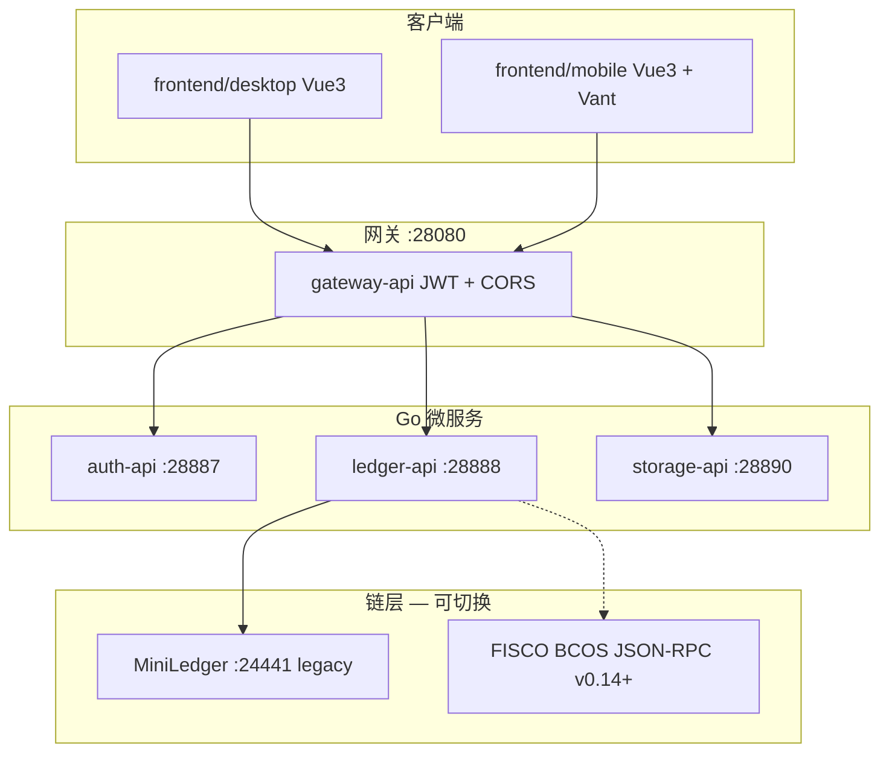

# Smart Ledger（go-Smart-ledger）

去中心化区块链自定义账本系统：支持私人账本与多人账本。  
**当前发布线（v0.13.0-miniledger）** 权威链为 [Chainscore MiniLedger](https://github.com/Chainscore/miniledger)；**v0.14+** 正在迁移至 **FISCO BCOS**（见 [FISCO 迁移](#fisco-bcos-迁移-v014)）。  
后端 **Go + go-zero 微服务**，前端 **Vue 3** 桌面 + 移动 Web/APK。

> **维护说明**：每次新增功能或变更规划时，请同步更新本文档——在「项目计划」中登记 idea，并在「已完成 / 未完成」中勾选状态。文末「更新记录」追加一条摘要。

---

## 产品概念：团队 vs 多人账本

| 维度 | **团队（Team）** | **多人账本（Multi Ledger）** |
|------|------------------|------------------------------|
| 本质 | **用户集合体**，协作入口，类似 QQ 群 / 企业微信群 | **记账工具**，链上事件溯源与封账锚定的数据容器 |
| 成员关系 | 团队 `team_members`：好友编组，便于发现「和谁一起干活」 | 账本 `members`：经 **邀请 → 对方同意** 后才有权读写 |
| 与账本关系 | 目标模型：**一个团队可关联多个账本**（快捷入口、通知聚合） | 每个账本权限 **独立**：在团队里 ≠ 能看账本 |
| 聊天 | **团队 Chat**（文字、文件，MySQL + 本地文件目录） | 无聊天；仅记账事件、审批、备份等 |
| 当前实现 | 多账本 `team_ledgers` + 团队详情 Chat；创建可多选账本 | 账本管理页：发送/接受邀请；详情页记账与封账 |

```text
  [团队 A] ──关联──► 账本 1、账本 2 …（规划：多账本）
       │                    ▲
       │ 成员列表            │ 仅「被邀请并接受」的用户
       ▼                    │ 可 list/get/sync 该账本
  [团队 Chat]              │
  (规划中)                 └── 权限边界在账本成员表 / 链上 MemberJoined
```

控制台入口：**账本管理** = 邀请与接受；**团队** = 组织协作圈；**好友** = 发现可邀请的人。

---

## 目录

- [产品概念：团队 vs 多人账本](#产品概念团队-vs-多人账本)
- [金融与会计能力展望](#金融与会计能力展望)
- [架构概览](#架构概览)
- [数据存储与私有化](#数据存储与私有化)
- [本地 SQLite · 云端备份 · 多人同步](#本地-sqlite--云端备份--多人同步)
- [离线 AI：OpenClaw 与账本 RAG](#离线-aiopenclaw-与账本-rag)
- [仓库结构](#仓库结构)
- [端口一览](#端口一览)
- [项目计划（功能清单）](#项目计划功能清单)
- [已完成](#已完成)
- [未完成 / 进行中](#未完成--进行中)
- [快速开始](#快速开始)
- [移动端与 APK 打包](#移动端与-apk-打包)
- [版本标签](#版本标签)
- [FISCO BCOS 迁移（v0.14+）](#fisco-bcos-迁移-v014)
- [更新记录](#更新记录)

---

## 架构概览



| 层级 | 技术 |
|------|------|
| 链（legacy） | Chainscore MiniLedger（REST + SQLite 世界状态） |
| 链（目标） | FISCO BCOS 联盟链 + `LedgerRegistry` 合约（[`docs/fisco-bcos-migration.md`](docs/fisco-bcos-migration.md)） |
| 链抽象 | `backend/pkg/chainstore`（`miniledger` / `fisco` 后端） |
| 后端 | go-zero REST 微服务 |
| 前端 | Vue 3 桌面（`frontend/desktop`）+ 移动 Web/APK（`frontend/mobile`） |
| 部署 | `deploy/compose/docker-compose.yml` + 可选 overlay（如 fisco） |

---

## 数据存储与私有化

### 推荐模型（本地优先 + 可选云端 + 多人同步）

| 数据 | 默认落点 | 用户可选 |
|------|----------|----------|
| 记账事件（权威） | 团队 **MiniLedger** 节点（服务端 SQLite） | — |
| 本机可读副本 | 用户浏览器 **本机 SQLite**（`sql.js` → IndexedDB 磁盘文件） | 「同步到本机」 |
| 加密全量备份 | 服务器本地卷 | **云端**：IPFS / 未来对象存储（均为密文） |
| 账号/好友/团队 | 自建 **MySQL** | — |

多人账本：成员通过 API **增量同步**（`sinceSeq`）把链上事件合并进各自本机库；写入仍以服务端链为准。

详见 [`docs/local-first-storage.md`](docs/local-first-storage.md)。

### 当前部署形态

| 数据类型 | 存放位置 | 谁能访问 |
|----------|----------|----------|
| 用户、好友、团队 | **自建 MySQL** | 登录用户 |
| 账本元数据与事件（权威） | **MiniLedger** 世界状态 | **账本成员** |
| 用户本机缓存 | 浏览器 IndexedDB 中的 SQLite 文件 | 仅该浏览器/设备 |
| 加密备份 | storage + 可选 **IPFS** | 持有备份密码者 |

### 与「仅相关用户/团队可见」的差距

| 能力 | 现状 | 说明 |
|------|------|------|
| 成员隔离 | ✅ | 私人账本创建者；多人账本须 **邀请且对方同意** 后加入 |
| 团队维度 | ✅ 部分 | 团队为成员集合；**不自动授予账本权限**；多账本绑定与 Chat 见 F36/F37 |
| 细粒度 RBAC | ⬜ | 无角色/权限矩阵（Fxx RBAC 未做） |
| 传输与静态加密 | 部分 | HTTPS/Cookie Secure（F27）；备份 Argon2+AES；可选账本 E2E（F19） |
| 审计与脱敏导出 | 部分 | 链上事件可追溯；RAG 导出需 JWT（见下） |

### 推荐私有化落地（生产）

1. **网络**：控制台与 API 仅内网或 VPN；前置 Nginx/TLS（[`docs/production-security.md`](docs/production-security.md)）；不将 MiniLedger/MySQL 端口直接暴露公网。
2. **密钥**：`SL_ACCESS_SECRET` / `SL_REFRESH_SECRET`、MySQL 口令、`HDWallet.Mnemonic`、EVM 私钥均走环境变量或 KMS（见 `.env.example`）。
3. **数据面**：MySQL 与 MiniLedger 数据卷仅授权运维可挂载；定期加密备份；IPFS 用私有集群或关闭 `ipfs` profile。
4. **权限**：在 RBAC 完成前，依赖「账本成员」边界；敏感账本开启 **F19 组级 E2E**，RAG/导出仅在客户端解密后进行。
5. **合规**：运维签署访问制度；链外锚定（F29）只上 Merkle 根，避免把明细写入公链。

```text
推荐拓扑（单机私有化）:

  [用户浏览器] --HTTPS--> [Nginx :443]
                              |
                    [gateway :28080 JWT]
                     /      |        \
              [auth]   [ledger]   [storage]
                 |         |
            [MySQL]   [MiniLedger :24441]
            (内网)      (Docker 卷，不对外)
```

---

## 金融与会计能力展望

从**财务会计**与**资金管理**角度，在现有「事件溯源 + Merkle 封账 + 可选 EVM 锚定」之上，可按优先级逐步扩展（见下表 F36–F50）。实现时建议保持：**明细在许可链 / 本机库，公链仅锚定摘要**。

### 核算与报表

| 方向 | 说明 |
|------|------|
| 复式记账 / 科目体系 | 借方、贷方、会计科目表；分录自动生成试算平衡 |
| 多币种与汇率 | 记账币种、期末重估、汇兑损益 |
| 会计期间 | 月结 / 年结、期间锁定、反结账审批 |
| 三大报表 | 资产负债表、利润表、现金流量表（由分录汇总） |
| 辅助核算 | 部门、项目、客户、供应商维度余额与明细账 |

### 控制与合规

| 方向 | 说明 |
|------|------|
| 职责分离（SoD） | 制单 / 审核 / 过账 / 封账分角色；与 F17 审批流衔接 |
| 凭证编号与附件 | 发票、合同哈希或 IPFS CID 挂接到分录 |
| 审计轨迹 | 谁何时改了什么（链上事件已具备基础，需业务层语义） |
| 税务辅助 | 增值税口径、简易计税标记（按地区模板扩展） |

### 资金与对账

| 方向 | 说明 |
|------|------|
| 银行 / 支付对账 | 导入对账单 CSV，与链上流水自动/半自动匹配 |
| 未达账项 | 在途、未清项调节表 |
| 预算与执行 | 科目或项目预算、超支预警 |
| 应收应付账龄 | 按往来方汇总账龄分析 |

### 协作与行业扩展

| 方向 | 说明 |
|------|------|
| 团队 Chat + 文件 | 讨论某笔可疑分录、共享扫描件（F37） |
| 标准报表导出 | PDF / Excel 审计包、XBRL（上市公司场景） |
| 与 OpenClaw 结合 | 自然语言查账、异常检测（在 F34 上增加财务 prompt / 规则） |

---

## 本地 SQLite · 云端备份 · 多人同步

| 操作 | 入口 |
|------|------|
| 同步单账本到本机 | 账本详情 → **同步到本机** |
| 同步全部账本 | 账本管理 → **全部同步到本机** |
| 云端备份 | 账本详情 → **加密备份（含云端）** / 备份页（需开启 IPFS 等） |
| API | `GET /api/v1/ledgers/:id/sync?sinceSeq=`（JWT，仅成员） |

实现代码：`frontend/desktop/src/localdb/db.js`。桌面端需 `npm install` 安装 `sql.js` 后构建。

---

## AI 助手与离线 RAG（可选）

默认使用**云端 API**（DeepSeek、OpenAI 等）：`make up` 启动账本与 Web 后，在 **设置 → AI 助手** 填写 API Key 并启用即可对话。

若需**完全离线**，可选启动 Ollama + OpenClaw（模型占用数 GB 磁盘）：

| 组件 | 路径 / 说明 |
|------|-------------|
| **默认启动** | `make up` — 账本 + Web，**不含 Ollama** |
| **离线 AI（可选）** | `make offline-ai-up` — Docker 启动 Ollama + OpenClaw Gateway |
| Compose profile | `offline-ai`：`ollama`、`ollama-init`、`openclaw-gateway` |
| 集成配置 | [`integrations/openclaw/`](integrations/openclaw/)；`scripts/init-openclaw-config.*` |
| 控制台 AI 设置 | **设置 → AI** → 云端填 API Key；离线选 Ollama 并参阅页面提示 |
| 控制台对话页 | **工作区 → AI 助手**（`/assistant`） |
| 聊天代理 API | `POST /api/v1/ai/chat`（JWT，网关转发，无需浏览器直连模型） |
| OpenClaw UI（离线） | http://127.0.0.1:18789 — 需 `make offline-ai-up` |
| RAG 导出 API | `GET /api/v1/ledgers/:id/rag-export`（JWT，仅成员） |
| 文档 | [`docs/openclaw-integration.md`](docs/openclaw-integration.md) |

**云端**：设置 → 选 DeepSeek 等 → 填 API Key → 启用。**离线**：设置 → 选 Ollama → 按页面「离线使用须知」部署；可选 `make offline-ai-up`。

---

## 仓库结构

```text
go-Smart-ledger/
├── README.md                 # 本文件：计划 + 进度
├── Makefile                  # 全栈构建入口
├── deploy/compose/           # Docker Compose 主栈与 overlay（fisco / raft / https 等）
├── .env.openclaw.example       # OpenClaw Docker 环境变量模板
├── integrations/openclaw/    # OpenClaw 工作区与示例配置（不含上游源码）
├── openclaw/                 # 由 setup-openclaw 克隆（gitignore）
├── docs/                     # production-security、evm-anchor、openclaw-integration
├── backend/                  # Go 后端工作区
│   ├── pkg/                  # 领域、JWT、xlsx、MiniLedger 客户端等
│   ├── services/
│   │   ├── gateway/          # API 网关、鉴权、反向代理
│   │   ├── auth/             # 登录、验证码、JWT
│   │   ├── ledger/           # 账本业务、导入、备份
│   │   └── storage/          # 加密备份 API
│   ├── infra/miniledger/     # 链节点 npm 启动脚本
│   └── deploy/               # Dockerfile、docker 专用配置
├── frontend/
│   ├── desktop/              # Vue3 桌面端（当前使用）
│   └── mobile/               # Vue3 + Vant 移动 Web / Capacitor APK
└── scripts/                  # build-linux.ps1、docker-up.ps1
```

---

## 端口一览

原 4 位数端口前加前缀 **`2`**（如 8080 → 28080）。

| 服务 | 端口 | 说明 |
|------|------|------|
| gateway-api | **28080** | 统一 API 入口 |
| ledger-api | **28888** | 账本业务 |
| storage-api | **28890** | 存储/备份 |
| auth-api | **28887** | 认证 / 用户 / 好友 / 团队 |
| MySQL（外部，配置） | **3306** | 用户/好友/团队/资料；`auth-api` 的 `Database.DataSource` |
| MiniLedger API | **24441** | 链 HTTP / 区块浏览器 |
| MiniLedger P2P | **24440** | 链 P2P |
| IPFS Kubo API | **25001** | 备份内容 Pin（容器内 5001） |
| IPFS Gateway | **28090** | 可选网关访问 CID |
| NSQ nsqd TCP | **24150** | 消息发布/消费（容器内 4150） |
| NSQ nsqd HTTP | **24151** | nsqd 管理 / ping |
| NSQ lookupd | **24161** / **24162** | 服务发现 |
| NSQ admin | **24171** | 队列监控 UI |
| 前端 web 桌面 / Vite | **25173** | 桌面控制台（Docker Nginx 或本地 dev） |
| 前端 web 移动 / Vite | **25175** | 移动 Web（Docker `web-mobile` 或本地 dev） |

---

## 项目计划（功能清单）

以下为产品与技术上的**完整规划**。新 idea 请先加在本表，实现后再移到「已完成」。

| ID | 功能 | 优先级 | 状态 |
|----|------|--------|------|
| F01 | 私人账本（单成员） | P0 | ✅ 已完成 |
| F02 | 多人账本（创建者可单独建账，成员经邀请加入） | P0 | ✅ 已完成 |
| F03 | 对接 Chainscore MiniLedger 作为链底层 | P0 | ✅ 已完成 |
| F04 | 事件溯源记账、Merkle 根、封账锚定 | P0 | ✅ 已完成 |
| F05 | go-zero 微服务（gateway / ledger / storage / auth） | P0 | ✅ 已完成 |
| F06 | 根目录 Docker Compose 一键部署 | P1 | ✅ 已完成 |
| F07 | 外部编译 + 增量构建 + 镜像仅 COPY 二进制 | P1 | ✅ 已完成 |
| F08 | JWT 登录：短期 token 内存、长期 token HttpOnly Cookie | P0 | ✅ 已完成 |
| F09 | 图形验证码（base64Captcha） | P0 | ✅ 已完成 |
| F10 | Vue3 桌面控制台（概览 / 账本 / 详情） | P0 | ✅ 已完成 |
| F11 | 前端工作区划分 desktop / mobile | P1 | ✅ 已完成（mobile 仅占位） |
| F12 | Excel 模板下载、解析、预览、批量导入上链 | P0 | ✅ 已完成 |
| F13 | 加密备份 / 恢复预览，与封账流程串联 | P0 | ✅ 已完成 |
| F14 | IPFS 去中心化内容存储（CID、Pin） | P0 | ✅ 已完成 |
| F15 | 备份与 IPFS 双写、链上记录 CID | P1 | ✅ 已完成 |
| F16 | 从备份快照**恢复写入**账本（非仅预览） | P1 | ✅ 已完成 |
| F17 | 多人账本多签 / 审批流 | P1 | ✅ 已完成 |
| F18 | 成员 P2P 同步、加入账本 | P2 | ✅ 已完成 |
| F19 | 账本数据组级端到端加密 | P2 | ✅ 已完成 |
| F20 | 用户注册、MySQL 用户体系、个人资料（昵称/头像） | P1 | ✅ 已完成（无 RBAC） |
| F31 | 好友系统：按用户 ID 搜索、申请/同意、删除 | P1 | ✅ 已完成 |
| F32 | 团队：成员集合 + 绑定多人账本入口（类 QQ 群，非账本权限） | P1 | ✅ 已完成 |
| F36 | 团队关联 **多个** 账本（N:M） | P2 | ✅ 已完成 |
| F37 | 团队 Chat：消息、文件传输 | P2 | ✅ 已完成 |
| F38 | 复式记账与会计科目表 | P2 | ✅ 已完成 |
| F39 | 会计期间与月结 / 期间锁定 | P2 | ✅ 已完成 |
| F40 | 三大财务报表（表内汇总） | P2 | ✅ 已完成 |
| F41 | 辅助核算（部门 / 项目 / 往来） | P3 | ✅ 已完成 |
| F42 | 银行对账与未达账项 | P2 | ✅ 已完成 |
| F43 | 预算编制与执行分析 | P3 | ✅ 已完成 |
| F44 | 凭证附件（发票 CID / 文件） | P2 | ✅ 已完成 |
| F45 | 应收应付账龄 | P3 | ✅ 已完成 |
| F46 | 多币种与期末汇率重估 | P3 | ✅ 已完成 |
| F47 | 税务口径模板（增值税等） | P3 | ✅ 已完成 |
| F48 | 审计包导出（PDF / Excel） | P2 | ✅ 已完成 |
| F49 | 账本多表（可选开启；开启后可建多表 + Excel 按表导入） | P2 | ✅ 已完成 |
| F33 | 雪花 ID（用户/账本/团队）+ HD 钱包 BIP44 账本地址 | P1 | ✅ 已完成 |
| F21 | 自定义账本字段 Schema / 动态模板 | P2 | ✅ 已完成 |
| F22 | MiniLedger 多节点 Raft 集群部署文档与 Compose | P1 | ✅ 已完成 |
| F23 | 上链失败重试队列、待上链状态 UI | P1 | ✅ 已完成 |
| F24 | 前端纳入 Docker（Nginx 托管 dist） | P1 | ✅ 已完成 |
| F25 | 移动端 Vue3 + Vant + Capacitor APK | P2 | ✅ 已完成 |
| F50 | FISCO BCOS 权威链迁移（合约/表、迁移、浏览器、Compose） | P1 | 🟡 进行中（v0.15.1 FISCO 3.x RPC 已合入） |
| F26 | 集成测试 / CI（GitHub Actions） | P2 | ⬜ 未完成 |
| F27 | 生产加固：密钥管理、HTTPS、Cookie Secure、限流 | P1 | ✅ 已完成 |
| F28 | go-zero gRPC + 服务发现（etcd） | P3 | ✅ 已完成 |
| F29 | 公链 / L2 合约锚定（替代仅 MiniLedger 状态） | P3 | ✅ 已完成 |
| F30 | 项目根 README 计划与进度维护 | P0 | ✅ 已完成 |
| F34 | OpenClaw + 可配置本地 AI | P2 | ✅ 已完成 |
| F35 | 本机 SQLite 副本 + 多人账本增量同步 | P1 | 🟡 进行中 |

**状态图例**：✅ 已完成 · 🟡 进行中 · ⬜ 未完成

---

### 后端

- [x] `backend/services/gateway`：JWT 鉴权、CORS、路由聚合
- [x] `backend/services/auth`：登录 / 刷新 / 登出 / 图形验证码；用户注册（雪花 ID）；好友与团队 API
- [x] `pkg/snowflake`：分布式 ID；`pkg/ledgerhd`：go-ethereum-hdwallet 分层确定性地址
- [x] `backend/services/ledger`：账本 CRUD、导入、备份 API
- [x] `backend/services/storage`：Argon2 + AES 磁盘加密备份
- [x] `pkg/miniledgerclient`：对接 MiniLedger REST；链浏览器代理 API（`/chain/*`）
- [x] `pkg/mq/nsq`：NSQ 生产者/消费者；`pkg/txqueue`：上链失败多步重试（NSQ 投递 + 本地状态）；`pkg/registry`：etcd 服务注册；`pkg/grpchsrv`：gRPC health
- [x] `pkg/importxlsx`：excelize 解析与模板生成

### 前端

- [x] `frontend/desktop`：Vue 3 + Pinia + Vue Router
- [x] 页面：登录、概览、账本管理（含邀请）、账本详情、Excel 导入、备份/恢复、**链浏览器**（`/chain`）
- [x] 短期 access token 仅存内存；refresh 走 Cookie
- [x] 用户端登录/注册页；好友页；团队列表与 **团队详情**（Chat + 多账本关联）
- [x] 账本列表展示 `ledgerAddress`；创建账本无需手填链上地址
- [x] Docker 服务 `web`：Nginx 托管 `dist`，`/api` 反代至 `gateway-api`

### 工程与部署

- [x] 根目录 `Makefile`、`deploy/compose/docker-compose.yml`（含 `web`；用户库为外部 MySQL）
- [x] Auth + MySQL：`users` / `friendships` / `friend_requests` / `teams` / `team_members` / `team_ledgers` / `team_messages`；脚本 `backend/infra/sql/001_schema.sql`
- [x] `ledger-api` 配置 `Snowflake.NodeID`（与 auth 区分）及 `HDWallet.Mnemonic`（生产须换密钥管理）
- [x] `scripts/build-linux.ps1`、`scripts/docker-up.ps1`
- [x] 端口 2xxxx 统一规范

---

### 已知限制

- **默认 Compose 仍启动 MiniLedger**；FISCO 为 overlay + 配置切换；`Chain.Backend: fisco` 且部署合约后可 KV 读写（v0.15.0-fisco.3）。
- 移动端 APK 打包需本机 **JDK 17+** 与 **Android SDK**（见 [移动端与 APK 打包](#移动端与-apk-打包)）。
- 默认 JWT/Cookie 密钥仅供开发，生产必须更换。

---

## 快速开始

### 环境要求

- Go 1.22+、Docker Desktop（运行中）
- **外部 MySQL 8**（须自行安装；默认 `root`/`123456`，库 `smart_ledger`；配置见 `auth-api` 的 `Database.DataSource`；Compose **不**内置 MySQL）
- Node.js 22+（仅 `make frontend-dev` 时需要；容器化前端不需要）
- Make（推荐）；Windows 无 Make 时可用 `scripts/*.ps1`

### 一行启动全栈（推荐）

先启动 Docker Desktop，在项目根目录执行：

```bash
make start
```

Windows PowerShell：

```powershell
.\scripts\start-all.ps1
```

流程：交叉编译 Go 服务 → `docker compose build` → 启动全部容器（含 **`web`**：Vue 构建产物 + Nginx，:25173 反代 `/api` 至网关）。停止全栈：`make down`。

| 服务 | Go 栈容器名 | Java 栈容器名 | 端口 |
|------|-------------|---------------|------|
| 控制台（桌面） | `smart-ledger-go-web` | `smart-ledger-java-web` | 25173 |
| 控制台（移动） | `smart-ledger-go-web-mobile` | — | 25175 |
| 网关 | `smart-ledger-go-gateway` | `smart-ledger-java-gateway` | 28080 |
| MiniLedger | `smart-ledger-go-miniledger` | `smart-ledger-java-miniledger` | 24441 |

Compose 项目名分别为 `smart-ledger-go`（`make up-go`）与 `smart-ledger-java`（`make up-java`），两套后端镜像与容器互不覆盖。

### 本地前端热更新（可选）

后端已 `make up` 时，在本机跑 Vite（不走 `web` 容器）：

```bash
make frontend-dev
```

依赖安装使用 `frontend/desktop/.npm-cache`（`.npmrc`）。Windows 可执行 `.\scripts\frontend-install.ps1`。

| 地址 | 说明 |
|------|------|
| http://localhost:25173 | Vue 控制台 |
| http://localhost:28080/api/v1/health | 网关健康检查 |
| http://localhost:24171 | NSQ Admin（上链重试队列监控） |
| http://localhost:25173/chain | 控制台内嵌链浏览器（中文 `/explorer-zh/`，英文 `/dashboard/`） |
| http://localhost:24441/dashboard | MiniLedger 原生浏览器（直连节点） |
| 默认账号 | `admin` / `admin123` |

### ID 与链上地址（开发说明）

| 对象 | 生成方式 | 配置 |
|------|----------|------|
| 用户 ID | 雪花（`auth-api` NodeID=1） | `Snowflake.NodeID` |
| 账本 ID | 雪花（`ledger-api` NodeID=2） | 同上 |
| 团队 ID | 雪花（auth 服务） | 同上 |
| 账本主地址 | BIP44 `m/44'/60'/0'/0/{ledgerIndex}` | `HDWallet.Mnemonic` |
| 成员地址 | BIP44 `m/44'/60'/0'/1/{ledgerIndex}/{memberIndex}` | 同上 |

开发环境默认助记词为 Hardhat 测试句（见 `ledger-api.yaml`），**生产必须更换**并妥善保管。

### 常用命令

```bash
make help            # 查看 Makefile 目标
make start           # 全栈（后端 + 前端开发服）
make logs            # Docker 日志
make down            # 停止栈
make frontend-build  # 构建桌面静态资源
make mobile-dev      # 移动 Web 开发服 :25175
make mobile-apk      # Android Debug APK（需 JDK + SDK）
```

### Raft 集群（F22，可选 · MiniLedger legacy）

```bash
docker compose stop miniledger
docker compose -f deploy/compose/docker-compose.yml -f deploy/compose/docker-compose.raft.yml --profile raft up -d miniledger-1 miniledger-2 miniledger-3
```

详见 [docs/miniledger-raft.md](docs/miniledger-raft.md)。

### etcd 服务发现（F28，可选）

```bash
docker compose -f deploy/compose/docker-compose.yml -f deploy/compose/docker-compose.discovery.yml --profile discovery up -d
```

将 `ledger-api` / `gateway-api` 配置换为 `deploy/etc/*.discovery.docker.yaml` 并重建镜像。

---

## 移动端与 APK 打包

| 形态 | 地址 / 产物 | 说明 |
|------|-------------|------|
| 移动 Web（Docker） | http://localhost:25175 | 服务 `web-mobile`，`/api` 反代网关 |
| 移动 Web（本地） | `make mobile-dev` | Vite :25175，代理 `/api` → :28080 |
| Android APK | `frontend/mobile/android/app/build/outputs/apk/debug/app-debug.apk` | Capacitor 7 壳 + 同上 Vue 构建产物 |

### 环境

- Node.js 22+
- **JDK 17+**（推荐 Android Studio 自带 JBR）
- **Android SDK**（Platform + Build-Tools）

### 一键打包（Windows）

```powershell
# 若系统 JAVA_HOME 损坏，先指定 Android Studio JBR：
$env:JAVA_HOME = 'D:\work\API\Android\Android studio\jbr'
$env:ANDROID_HOME = 'D:\work\API\Android\Sdk'

.\scripts\mobile-apk.ps1
# 或 make mobile-apk
```

脚本会：`npm install` → `vite build` → `cap sync android` → 检测 JDK/SDK → `gradlew assembleDebug`。

### APK 连接后端

安装后在 App **我的 → 服务器** 填写 API 基址，例如：

- 局域网 Docker：`http://192.168.x.x:25175/api/v1`
- 模拟器访问本机：`http://10.0.2.2:25175/api/v1`

### 常见问题

| 错误 | 处理 |
|------|------|
| `系统无法执行指定的程序` (9020) | `JAVA_HOME` 指向的 `java.exe` 无法运行；改用 Android Studio `jbr` |
| Gradle 下载超时 | 配置代理或 Gradle 镜像；脚本已将 wrapper 超时设为 120s |
| 找不到 SDK | Android Studio → SDK Manager；或设置 `ANDROID_HOME` |

详见 [`frontend/mobile/README.md`](frontend/mobile/README.md)。

---

## 版本标签

Git annotated tags 标记里程碑；**MiniLedger 时代线** 止于 `v0.13.0-miniledger` / `miniledger-era`。

| 标签 | 说明 |
|------|------|
| `v0.1.0` … `v0.12.0` | 自初始骨架至 OpenAPI / 模板同步 |
| `v0.13.0-miniledger` | 移动 Web + APK；**MiniLedger 顶层链最后稳定线** |
| `miniledger-era` | 同上（快速引用） |
| `v0.14.x-fisco.*` | FISCO BCOS 迁移各阶段（见下） |

查看：`git tag -l --sort=v:refname`

---

## FISCO BCOS 迁移（v0.14+）

目标：**完全以 FISCO BCOS 为权威账本**——合约/表重做账本创建、事件、成员、审批、复式状态；迁移历史数据；链浏览器、重试队列、Compose 文档换一套。

| 已完成 | 进行中 / 待办 |
|--------|----------------|
| `putState`/`getState` KV（v0.15.0-fisco.3） | `txqueue` FISCO 重试语义 |
| FISCO BCOS **3.x 原生 RPC**（v0.15.1-fisco.4） | 默认 Compose 切 FISCO |
| MiniLedger 适配器（默认不变） | 前端链浏览器 UI 优化 |
| 迁移工具 `migrate-miniledger-to-fisco` | |

**文档**：[`docs/fisco-bcos-migration.md`](docs/fisco-bcos-migration.md)  
**建链**：[`backend/infra/fisco/README.md`](backend/infra/fisco/README.md)  
**配置示例**：[`backend/deploy/etc/ledger-api.fisco.docker.yaml`](backend/deploy/etc/ledger-api.fisco.docker.yaml)

```bash
# 启用 FISCO profile（内置 fisco-node 容器，见 backend/infra/fisco/）
make fisco-dev-up
# 或仅链：make fisco-up
```

---

## 更新记录

- 2026-05-24：**FISCO 3.x 容器化** — `fisco-node` 镜像 + Compose overlay；`make fisco-up` / `make fisco-dev-up`。
- 2026-05-24：**v0.15.1-fisco.4** — FISCO BCOS 3.x 原生 JSON-RPC；纯 Go 交易签名；`/chain` GetRaw 区块/节点查询。
- 2026-05-24：**v0.15.0-fisco.3** — FISCO `putState`/`getState` 对接 ledgersvc KV；链上键索引；`PrivateKeyHex` / `SL_FISCO_PRIVATE_KEY`。
- 2026-06-04：**v0.14.2-fisco.2** — FISCO 合约骨架、chainstore、fisco compose；README 增补 APK 与迁移路线图。
- 2026-06-04：**v0.13.0-miniledger** — 移动端 Web/APK；Git 标签标记 MiniLedger 顶层链时代线。

## 更新规范

新增或完成一项功能时，请按顺序操作：

1. 在 [项目计划（功能清单）](#项目计划功能清单) 中**新增一行**（若尚无对应 Fxx），状态标为 🟡 或 ⬜。
2. 实现完成后：计划表改为 ✅，并在 [已完成](#已完成) 勾选对应条目。
3. 在 [更新记录](#更新记录) **顶部**追加一行（日期 + 一句话摘要）。
4. 若涉及新端口、新服务或新命令，同步更新本文「端口一览」「快速开始」。

示例（追加计划项）：

```markdown
| F31 | 某某新功能 | P1 | ⬜ 未完成 |
```

完成实现后：

```markdown
| F31 | 某某新功能 | P1 | ✅ 已完成 |
```

并在更新记录中写：`YYYY-MM-DD：完成 F31 某某新功能（简要说明）。`
