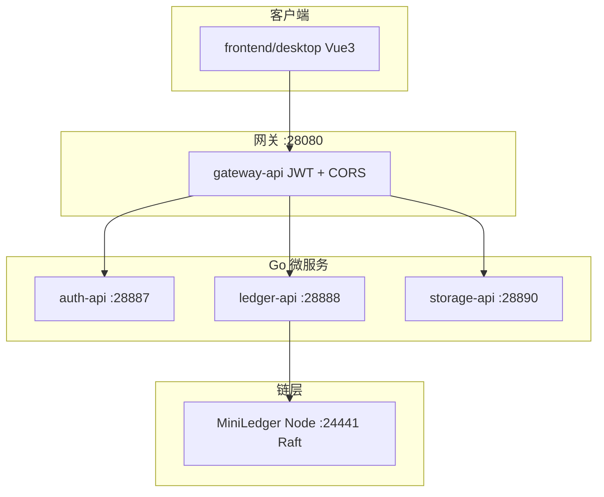

# Smart Ledger（go-Smart-ledger）

去中心化区块链自定义账本系统：支持私人账本与多人账本，底层基于 [Chainscore MiniLedger](https://github.com/Chainscore/miniledger) 许可链，后端采用 **Go + go-zero 微服务**，前端采用 **Vue 3 桌面控制台**。

> **维护说明**：每次新增功能或变更规划时，请同步更新本文档——在「项目计划」中登记 idea，并在「已完成 / 未完成」中勾选状态。文末「更新记录」追加一条摘要。

---

## 目录

- [架构概览](#架构概览)
- [仓库结构](#仓库结构)
- [端口一览](#端口一览)
- [项目计划（功能清单）](#项目计划功能清单)
- [已完成](#已完成)
- [未完成 / 进行中](#未完成--进行中)
- [快速开始](#快速开始)
- [更新记录](#更新记录)

---

## 架构概览



| 层级 | 技术 |
|------|------|
| 链 | Chainscore MiniLedger（Node.js，REST + SQLite 世界状态） |
| 后端 | go-zero REST 微服务，外部交叉编译后 COPY 进 Docker |
| 前端 | Vue 3 + Vite + Pinia（`frontend/desktop`） |
| 部署 | 根目录 `docker-compose.yml` |

---

## 仓库结构

```text
go-Smart-ledger/
├── README.md                 # 本文件：计划 + 进度
├── Makefile                  # 全栈构建入口
├── docker-compose.yml        # 一键启动后端 + MiniLedger
├── backend/                  # Go 后端工作区
│   ├── pkg/                  # 领域、JWT、xlsx、MiniLedger 客户端等
│   ├── services/
│   │   ├── gateway/          # API 网关、鉴权、反向代理
│   │   ├── auth/             # 登录、验证码、JWT
│   │   ├── ledger/           # 账本业务、导入、备份
│   │   └── storage/          # 加密备份 API
│   ├── infra/miniledger/     # 链节点 npm 启动脚本
│   └── deploy/               # Dockerfile、docker 专用配置
├── frontend/
│   ├── desktop/              # Vue3 桌面端（当前使用）
│   └── mobile/               # 移动端预留
└── scripts/                  # build-linux.ps1、docker-up.ps1
```

---

## 端口一览

原 4 位数端口前加前缀 **`2`**（如 8080 → 28080）。

| 服务 | 端口 | 说明 |
|------|------|------|
| gateway-api | **28080** | 统一 API 入口 |
| ledger-api | **28888** | 账本业务 |
| storage-api | **28890** | 存储/备份 |
| auth-api | **28887** | 认证 / 用户 / 好友 / 团队 |
| MySQL（外部，配置） | **3306** | 用户/好友/团队/资料；`auth-api` 的 `Database.DataSource` |
| MiniLedger API | **24441** | 链 HTTP / 区块浏览器 |
| MiniLedger P2P | **24440** | 链 P2P |
| IPFS Kubo API | **25001** | 备份内容 Pin（容器内 5001） |
| IPFS Gateway | **28090** | 可选网关访问 CID |
| NSQ nsqd TCP | **24150** | 消息发布/消费（容器内 4150） |
| NSQ nsqd HTTP | **24151** | nsqd 管理 / ping |
| NSQ lookupd | **24161** / **24162** | 服务发现 |
| NSQ admin | **24171** | 队列监控 UI |
| 前端 web / Vite | **25173** | 控制台（Docker Nginx 或本地 dev） |

---

## 项目计划（功能清单）

以下为产品与技术上的**完整规划**。新 idea 请先加在本表，实现后再移到「已完成」。

| ID | 功能 | 优先级 | 状态 |
|----|------|--------|------|
| F01 | 私人账本（单成员） | P0 | ✅ 已完成 |
| F02 | 多人账本（创建时 ≥2 人） | P0 | ✅ 已完成 |
| F03 | 对接 Chainscore MiniLedger 作为链底层 | P0 | ✅ 已完成 |
| F04 | 事件溯源记账、Merkle 根、封账锚定 | P0 | ✅ 已完成 |
| F05 | go-zero 微服务（gateway / ledger / storage / auth） | P0 | ✅ 已完成 |
| F06 | 根目录 Docker Compose 一键部署 | P1 | ✅ 已完成 |
| F07 | 外部编译 + 增量构建 + 镜像仅 COPY 二进制 | P1 | ✅ 已完成 |
| F08 | JWT 登录：短期 token 内存、长期 token HttpOnly Cookie | P0 | ✅ 已完成 |
| F09 | 图形验证码（base64Captcha） | P0 | ✅ 已完成 |
| F10 | Vue3 桌面控制台（概览 / 账本 / 详情） | P0 | ✅ 已完成 |
| F11 | 前端工作区划分 desktop / mobile | P1 | ✅ 已完成（mobile 仅占位） |
| F12 | Excel 模板下载、解析、预览、批量导入上链 | P0 | ✅ 已完成 |
| F13 | 加密备份 / 恢复预览，与封账流程串联 | P0 | ✅ 已完成 |
| F14 | IPFS 去中心化内容存储（CID、Pin） | P0 | ✅ 已完成 |
| F15 | 备份与 IPFS 双写、链上记录 CID | P1 | ✅ 已完成 |
| F16 | 从备份快照**恢复写入**账本（非仅预览） | P1 | ✅ 已完成 |
| F17 | 多人账本多签 / 审批流 | P1 | ✅ 已完成 |
| F18 | 成员 P2P 同步、加入账本 | P2 | ✅ 已完成 |
| F19 | 账本数据组级端到端加密 | P2 | ✅ 已完成 |
| F20 | 用户注册、MySQL 用户体系、个人资料（昵称/头像） | P1 | ✅ 已完成（无 RBAC） |
| F31 | 好友系统：按用户 ID 搜索、添加、删除 | P1 | ✅ 已完成 |
| F32 | 团队：绑定多人账本 + 邀请 ≥1 好友（类拉群） | P1 | ✅ 已完成 |
| F33 | 雪花 ID（用户/账本/团队）+ HD 钱包 BIP44 账本地址 | P1 | ✅ 已完成 |
| F21 | 自定义账本字段 Schema / 动态模板 | P2 | ✅ 已完成 |
| F22 | MiniLedger 多节点 Raft 集群部署文档与 Compose | P1 | ✅ 已完成 |
| F23 | 上链失败重试队列、待上链状态 UI | P1 | ✅ 已完成 |
| F24 | 前端纳入 Docker（Nginx 托管 dist） | P1 | ✅ 已完成 |
| F25 | 移动端 Vue3 / Uni-app | P2 | ⬜ 未完成 |
| F26 | 集成测试 / CI（GitHub Actions） | P2 | ⬜ 未完成 |
| F27 | 生产加固：密钥管理、HTTPS、Cookie Secure、限流 | P1 | ⬜ 未完成 |
| F28 | go-zero gRPC + 服务发现（etcd） | P3 | ✅ 已完成 |
| F29 | 公链 / L2 合约锚定（替代仅 MiniLedger 状态） | P3 | ⬜ 未完成 |
| F30 | 项目根 README 计划与进度维护 | P0 | ✅ 已完成 |

**状态图例**：✅ 已完成 · 🟡 进行中 · ⬜ 未完成

---

## 已完成

### 产品与业务

- [x] 私人账本、多人账本（≥2 人创建校验）；账本 ID 雪花生成，主地址与成员地址由 HD 钱包（BIP44）派生
- [x] 账本记账字段 Schema：默认模板（记账人/收账人/金额/日期/备注），创建时可选自 built-in 或自定义列；Excel 导入按 Schema 生成模板
- [x] 记账模板管理页：内置 + 用户自定义模板 CRUD（`/entry-templates`）
- [x] 团队：创建时选择多人账本并邀请至少 1 位好友
- [x] 记账、事件流水、完整性校验、封账锚定（写入 MiniLedger）
- [x] Excel 导入全流程（模板 → 预览 → 批量入账 → 可选自动封账）
- [x] 账本加密备份：本地 + IPFS 双写、Pin；`BackupAnchored` 事件记录 ref/CID 上链
- [x] 恢复：预览解密快照；`restore/commit` 写回账本（可选覆盖模式）；IPFS CID 回源
- [x] 导入/详情页与封账、备份流程串联
- [x] **F17 多签审批**：多人账本默认需 2 人批准；`propose` / `approve` / `reject`；详情页待审批列表
- [x] **F18 成员同步与加入**：邀请成员、我的邀请页、接受加入链上 `MemberJoined`；`GET /ledgers/:id/sync` 增量同步；账本列表按成员过滤
- [x] **F19 组级 E2E 加密**：创建多人账本可选加密口令；客户端 AES-GCM 加密 `entry.data`；`user_public_keys` 表与密钥轮换 API
- [x] **F22 Raft 集群**：`docker-compose.raft.yml` 三节点编排 + `docs/miniledger-raft.md`
- [x] **F23 上链重试**：`pkg/txqueue` + **NSQ** 异步重试；本地 JSON 状态 + topic `chain_tx_retry`；`/api/v1/chain/queue`；概览与链浏览器页展示待上链
- [x] **F28 服务发现**：etcd 注册/发现；ledger gRPC health（:28898）；`docker-compose.discovery.yml`；`GET /api/v1/discovery/services`
- [x] **链浏览器页**：控制台 `/chain` 内嵌 MiniLedger Dashboard（Nginx `/miniledger/` 反代）

### 后端

- [x] `backend/services/gateway`：JWT 鉴权、CORS、路由聚合
- [x] `backend/services/auth`：登录 / 刷新 / 登出 / 图形验证码；用户注册（雪花 ID）；好友与团队 API
- [x] `pkg/snowflake`：分布式 ID；`pkg/ledgerhd`：go-ethereum-hdwallet 分层确定性地址
- [x] `backend/services/ledger`：账本 CRUD、导入、备份 API
- [x] `backend/services/storage`：Argon2 + AES 磁盘加密备份
- [x] `pkg/miniledgerclient`：对接 MiniLedger REST；链浏览器代理 API（`/chain/*`）
- [x] `pkg/mq/nsq`：NSQ 生产者/消费者；`pkg/txqueue`：上链失败多步重试（NSQ 投递 + 本地状态）；`pkg/registry`：etcd 服务注册；`pkg/grpchsrv`：gRPC health
- [x] `pkg/importxlsx`：excelize 解析与模板生成

### 前端

- [x] `frontend/desktop`：Vue 3 + Pinia + Vue Router
- [x] 页面：登录、概览、账本管理、账本详情、Excel 导入、备份/恢复、**链浏览器**（`/chain`）
- [x] 短期 access token 仅存内存；refresh 走 Cookie
- [x] 用户端登录/注册页；好友页（ID 搜索、添加、删除）；团队页（选多人账本 + 勾选好友）
- [x] 账本列表展示 `ledgerAddress`；创建账本无需手填链上地址
- [x] Docker 服务 `web`：Nginx 托管 `dist`，`/api` 反代至 `gateway-api`

### 工程与部署

- [x] 根目录 `Makefile`、`docker-compose.yml`（含 `web`；用户库为外部 MySQL）
- [x] Auth + MySQL：`users`（雪花 ID）/ `friendships` / `teams` / `team_members`；脚本 `backend/infra/sql/001_schema.sql`
- [x] `ledger-api` 配置 `Snowflake.NodeID`（与 auth 区分）及 `HDWallet.Mnemonic`（生产须换密钥管理）
- [x] `scripts/build-linux.ps1`、`scripts/docker-up.ps1`
- [x] 端口 2xxxx 统一规范

---

## 未完成 / 进行中

### 高优先级（建议下一步）

| 功能 | 说明 |
|------|------|
| **RBAC / 权限** | 角色与细粒度权限（当前仅 JWT 登录用户） |

### 中低优先级

- 真 P2P 节点直连同步（当前为链上邀请 + HTTP 增量同步）
- 移动端、CI、生产安全加固
- 自定义字段 Schema、公链 L2 合约锚定

### 已知限制

- 移动端目录仅为占位，无实现。
- 默认 JWT/Cookie 密钥仅供开发，生产必须更换。
- 根目录 `data/miniledger.db` 等为早期残留，与当前架构无关，可清理。

---

## 快速开始

### 环境要求

- Go 1.22+、Docker Desktop（运行中）
- **外部 MySQL 8**（须自行安装；默认 `root`/`123456`，库 `smart_ledger`；配置见 `auth-api` 的 `Database.DataSource`；Compose **不**内置 MySQL）
- Node.js 22+（仅 `make frontend-dev` 时需要；容器化前端不需要）
- Make（推荐）；Windows 无 Make 时可用 `scripts/*.ps1`

### 一行启动全栈（推荐）

先启动 Docker Desktop，在项目根目录执行：

```bash
make start
```

Windows PowerShell：

```powershell
.\scripts\start-all.ps1
```

流程：交叉编译 Go 服务 → `docker compose build` → 启动全部容器（含 **`web`**：Vue 构建产物 + Nginx，:25173 反代 `/api` 至网关）。停止全栈：`make down`。

| 服务 | 容器名 | 端口 |
|------|--------|------|
| 控制台 | `smart-ledger-web` | 25173 |
| 网关 | `smart-ledger-gateway` | 28080 |
| MiniLedger | `smart-ledger-miniledger` | 24441 |

### 本地前端热更新（可选）

后端已 `make up` 时，在本机跑 Vite（不走 `web` 容器）：

```bash
make frontend-dev
```

依赖安装使用 `frontend/desktop/.npm-cache`（`.npmrc`）。Windows 可执行 `.\scripts\frontend-install.ps1`。

| 地址 | 说明 |
|------|------|
| http://localhost:25173 | Vue 控制台 |
| http://localhost:28080/api/v1/health | 网关健康检查 |
| http://localhost:24171 | NSQ Admin（上链重试队列监控） |
| http://localhost:25173/chain | 控制台内嵌链浏览器（推荐） |
| http://localhost:24441/dashboard | MiniLedger 原生浏览器（直连节点） |
| 默认账号 | `admin` / `admin123` |

### ID 与链上地址（开发说明）

| 对象 | 生成方式 | 配置 |
|------|----------|------|
| 用户 ID | 雪花（`auth-api` NodeID=1） | `Snowflake.NodeID` |
| 账本 ID | 雪花（`ledger-api` NodeID=2） | 同上 |
| 团队 ID | 雪花（auth 服务） | 同上 |
| 账本主地址 | BIP44 `m/44'/60'/0'/0/{ledgerIndex}` | `HDWallet.Mnemonic` |
| 成员地址 | BIP44 `m/44'/60'/0'/1/{ledgerIndex}/{memberIndex}` | 同上 |

开发环境默认助记词为 Hardhat 测试句（见 `ledger-api.yaml`），**生产必须更换**并妥善保管。

### 常用命令

```bash
make help            # 查看 Makefile 目标
make start           # 全栈（后端 + 前端开发服）
make logs            # Docker 日志
make down            # 停止栈
make frontend-build  # 构建前端静态资源
```

### Raft 集群（F22，可选）

```bash
docker compose stop miniledger
docker compose -f docker-compose.yml -f docker-compose.raft.yml --profile raft up -d miniledger-1 miniledger-2 miniledger-3
```

详见 [docs/miniledger-raft.md](docs/miniledger-raft.md)。`ledger-api` 的 `MiniLedger.BaseURL` 应指向 leader（通常为 node1 `:24441`）。

### etcd 服务发现（F28，可选）

```bash
docker compose -f docker-compose.yml -f docker-compose.discovery.yml --profile discovery up -d
```

将 `ledger-api` / `gateway-api` 配置换为 `deploy/etc/*.discovery.docker.yaml`（`Discovery.Etcd.Enabled: true`）并重建镜像后，`ledger-api` 会向 etcd 注册 HTTP/gRPC；网关 `GET /api/v1/discovery/services` 可查看注册表。默认单栈已开启 gRPC health（`:28898`），etcd 为可选。

---

## 更新记录

| 日期 | 摘要 |
|------|------|
| 2026-05-24 | 消息队列改用 **NSQ**（nsqd/lookupd/admin）；上链重试经 topic `chain_tx_retry` 异步消费。 |
| 2026-05-24 | F22/F23/F28：Raft 三节点 Compose；上链重试队列与链浏览器页；etcd + gRPC health 服务发现。 |
| 2026-05-23 | F14–F16：IPFS Kubo 存储；备份本地+IPFS 双写与链上 CID；`restore/commit` 快照写回账本。 |
| 2026-05-23 | 记账模板管理页（`/entry-templates`）；MySQL `entry_templates` 表；侧栏「记账模板」。 |
| 2026-05-23 | F21：账本条目 Schema；默认模板（记账人/收账人/金额/日期/备注）；创建账本可选模板或自定义字段；动态表单与 Excel 按 Schema 导入。 |
| 2026-05-23 | F32/F33：雪花 ID（用户/账本/团队）；HD 钱包派生账本与成员地址；团队页（多人账本+好友）；README 与 MySQL 表 `teams`/`team_members`。 |
| 2026-05-23 | 移除 Compose 内置 MySQL；用户数据仅存 `Database.DataSource` 配置库；账号注销（校验用户名+密码）。 |
| 2026-05-23 | 用户个人中心：昵称修改、头像上传；`users` 表扩展 `nickname`/`avatar_url`。 |
| 2026-05-23 | 修复概览页 MiniLedger 误显示离线：网关 `/health` 聚合 ledger 链状态。 |
| 2026-05-22 | 后端 `infra/sql/001_schema.sql` + `pkg/db` 启动时检测并创建库/表/字段/索引/外键。 |
| 2026-05-22 | Compose `mysql` 不再映射宿主机 3306，避免与本机 MySQL 端口冲突。 |
| 2026-05-22 | F31：MySQL 用户/好友 API；用户端登录注册与好友页；Compose 增加 `mysql`。 |
| 2026-05-22 | F24：前端容器化 `web`（`frontend/desktop/Dockerfile` + Nginx 反代）；`make start` 仅 Docker 全栈。 |
| 2026-05-22 | 前端 npm 改用项目内 `.npm-cache`（`.npmrc` + `scripts/frontend-install.ps1`），规避全局 node_cache EPERM。 |
| 2026-05-22 | 修复 Docker 健康检查：`wget --spider`（HEAD）改为 GET，避免 go-zero 返回 405 导致 auth/storage 等 unhealthy。 |
| 2026-05-22 | 快速开始增加一行全栈启动：`make start` / `scripts/start-all.ps1`（Docker 后端 + Vue 开发服）。 |
| 2026-05-24 | 完成 F17 多人账本审批流、F18 成员邀请/增量同步、F19 客户端组级 E2E 加密；新增协作 API 与「账本邀请」页。 |
| 2026-05-22 | 初始化项目计划 README；汇总至 F30：私人/多人账本、MiniLedger、go-zero 微服务、JWT+验证码、Vue3 桌面端、Excel 导入、加密备份与封账串联、Docker 与外部编译流程。 |
| 2026-05-22 | 记录 F12/F13/F11/F10/F08/F09 等为已完成；F14–F29 登记为未完成后续项。 |

---

## 更新规范

新增或完成一项功能时，请按顺序操作：

1. 在 [项目计划（功能清单）](#项目计划功能清单) 中**新增一行**（若尚无对应 Fxx），状态标为 🟡 或 ⬜。
2. 实现完成后：计划表改为 ✅，并在 [已完成](#已完成) 勾选对应条目。
3. 在 [更新记录](#更新记录) **顶部**追加一行（日期 + 一句话摘要）。
4. 若涉及新端口、新服务或新命令，同步更新本文「端口一览」「快速开始」。

示例（追加计划项）：

```markdown
| F31 | 某某新功能 | P1 | ⬜ 未完成 |
```

完成实现后：

```markdown
| F31 | 某某新功能 | P1 | ✅ 已完成 |
```

并在更新记录中写：`YYYY-MM-DD：完成 F31 某某新功能（简要说明）。`
