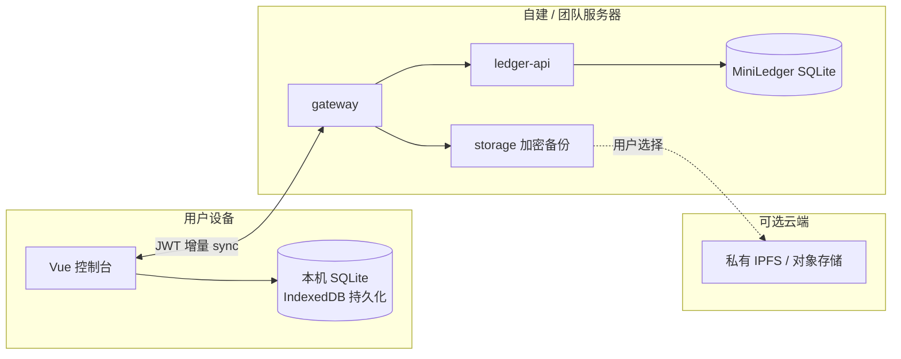

# 本地 SQLite + 云端备份 + 多人同步

## 目标架构

| 层级 | 说明 |
|------|------|
| **权威账本** | 团队共用的 MiniLedger 节点（服务端），多人写入与 Merkle 校验 |
| **本机副本** | 浏览器 `sql.js` + IndexedDB，数据落在用户磁盘，可离线查看 |
| **云端备份** | 用户主动「加密备份」：本地卷 + 可选 IPFS/对象存储（密文） |
| **多人同步** | `GET /ledgers/:id/sync?sinceSeq=` 增量拉取；控制台「同步到本机」 |

## 已实现（桌面端）

- [`frontend/desktop/src/localdb/db.js`](../frontend/desktop/src/localdb/db.js)：本地库表 `ledgers` / `events` / `sync_cursors`
- 账本详情：**同步到本机**；记账成功后自动尝试更新本地库
- 账本列表：**全部同步到本机**
- 备份页：加密快照双写（本地 + IPFS profile）

## 云端备份选项

| 方式 | 配置 | 说明 |
|------|------|------|
| 本地卷 | 默认 | `storage-api` / ledger 备份目录 |
| IPFS | `docker compose --profile ipfs`，`IPFS.Enabled: true` | 密文 CID，可自建私有 swarm |
| 对象存储 | 待接 | 建议在 storage 服务增加 S3/MinIO 适配，仍只存密文 |

## 后续增强（规划）

- Tauri / Electron：SQLite 文件直写用户目录（替代 IndexedDB 封装）
- 后台定时 sync（Service Worker / 桌面守护进程）
- 冲突策略：以链上序号为准，本地仅作缓存
- 端到端加密账本：本地库只存密文，查看时客户端解密
