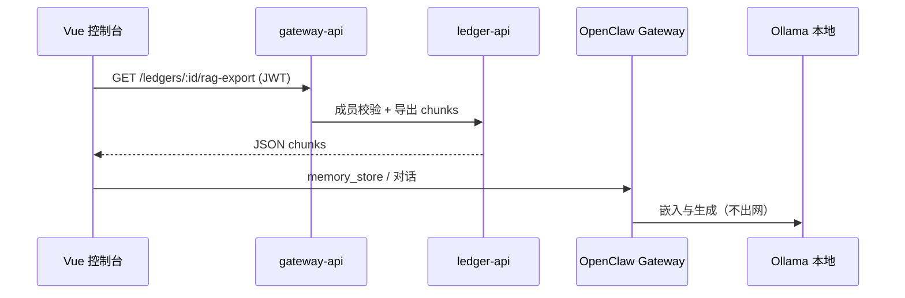

# OpenClaw 离线 AI 与账本 RAG（F34）

[OpenClaw](https://github.com/openclaw/openclaw) 是本地优先的个人 AI Gateway。本仓库通过 **`openclaw/` 目录（脚本克隆，不提交 Git）** + **`integrations/openclaw/`** 与 Smart Ledger 对接。

## 安装 OpenClaw 到项目根目录

Windows:

```powershell
.\scripts\setup-openclaw.ps1
cd openclaw
pnpm install
pnpm openclaw onboard --install-daemon
```

Linux / macOS:

```bash
chmod +x scripts/setup-openclaw.sh
./scripts/setup-openclaw.sh
cd openclaw && pnpm install && pnpm openclaw onboard --install-daemon
```

> Windows 原生支持有限，官方推荐 **WSL2** 运行 Gateway。

## 配置

1. 控制台 **设置 → 离线 AI（OpenClaw）** 填写 Ollama 地址、对话/向量模型，点击 **复制 OpenClaw 配置片段**。
2. 将片段合并到 `openclaw/openclaw.json`（或参考 [`integrations/openclaw/openclaw.example.json`](../integrations/openclaw/openclaw.example.json)）。
3. 本地启动 Ollama 并拉取模型，例如：`ollama pull llama3.2` 与 `ollama pull nomic-embed-text`。

## 账本 RAG 数据流



- API：`GET /api/v1/ledgers/:id/rag-export`（仅账本成员可访问）。
- 脚本：[`integrations/openclaw/scripts/index-ledger-rag.ps1`](../integrations/openclaw/scripts/index-ledger-rag.ps1) 可生成 JSONL 供批量索引。
- Agent 说明：[`integrations/openclaw/workspace-smart-ledger/AGENTS.md`](../integrations/openclaw/workspace-smart-ledger/AGENTS.md)。

## 可选 Compose

```bash
docker compose -f docker-compose.openclaw.yml up -d ollama
```

Ollama 与 OpenClaw Gateway 仍建议在宿主机/WSL 运行，便于访问本机 `openclaw/` 工作区。
