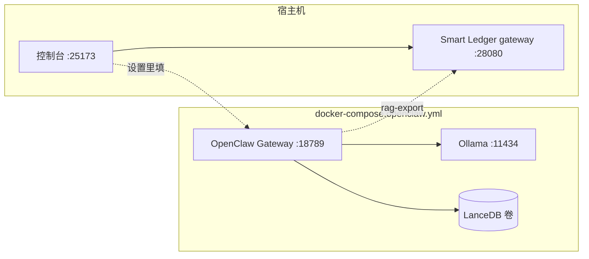
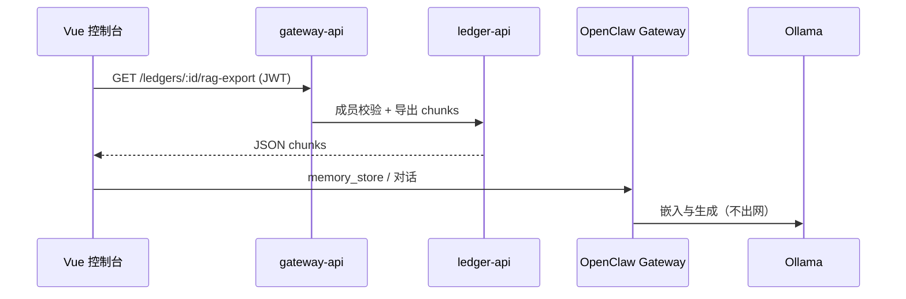

# OpenClaw 离线 AI 与账本 RAG（F34）

[OpenClaw](https://github.com/openclaw/openclaw) 是本地优先的个人 AI Gateway。本仓库通过 **`integrations/openclaw/`** 工作区与 Smart Ledger 对接；Gateway 与 Ollama 推荐用 **Docker** 一键部署。

## 架构



| 组件 | 说明 |
|------|------|
| `ollama` | 本地对话与向量模型（容器内 `http://ollama:11434`） |
| `openclaw-gateway` | AI Gateway + memory-lancedb，工作区挂载 `integrations/openclaw/workspace-smart-ledger` |
| `data/openclaw/config` | `openclaw.json`、状态（持久化，gitignore） |
| `data/openclaw/lancedb` | 向量库目录 |

## 方式一：Docker 部署（推荐）

### 前置

1. 已安装 Docker Desktop / Docker Engine + Compose v2。
2. 已启动 Smart Ledger 主栈（账本 API 可供 RAG 导出）：

```bash
make up
# 或 docker compose up -d
```

### 一键启动

**Linux / macOS / WSL：**

```bash
chmod +x scripts/setup-openclaw-docker.sh
./scripts/setup-openclaw-docker.sh
```

**Windows PowerShell：**

```powershell
.\scripts\setup-openclaw-docker.ps1
```

脚本会：

- 从 `integrations/openclaw/openclaw.docker.json` 生成 `data/openclaw/config/openclaw.json`（若不存在）
- 创建 `.env.openclaw` 并生成 `OPENCLAW_GATEWAY_TOKEN`
- 拉取 `ghcr.io/openclaw/openclaw:latest` 与 `ollama/ollama`
- 在 Ollama 中拉取 `llama3.2`、`nomic-embed-text`（可在 `.env.openclaw` 修改模型名）
- 启动 Gateway

### 访问

| 地址 | 用途 |
|------|------|
| http://127.0.0.1:18789 | OpenClaw Control UI（需粘贴 `.env.openclaw` 中的 token） |
| http://127.0.0.1:11434 | Ollama API（宿主机访问） |

### 控制台 AI 设置

**设置 → AI 助手** 填写（与 Docker 栈一致）：

| 项 | 值 |
|----|-----|
| API 地址 | `http://127.0.0.1:11434/v1` |
| 对话模型 | `llama3.2` |
| 向量模型 | `nomic-embed-text` |
| OpenClaw Gateway | `http://127.0.0.1:18789` |

也可点击 **复制 OpenClaw 配置片段**，再合并进 `data/openclaw/config/openclaw.json`（容器内 Ollama 地址应仍为 `http://ollama:11434/v1`，勿改成 127.0.0.1）。

### 常用命令

```bash
# 查看状态
docker compose --env-file .env.openclaw -f docker-compose.openclaw.yml ps

# 日志
docker compose --env-file .env.openclaw -f docker-compose.openclaw.yml logs -f openclaw-gateway

# 停止
docker compose --env-file .env.openclaw -f docker-compose.openclaw.yml down

# OpenClaw CLI（管理频道等）
docker compose --env-file .env.openclaw -f docker-compose.openclaw.yml --profile cli run --rm openclaw-cli status
```

Makefile 快捷目标：

```bash
make openclaw-up      # 运行 setup 脚本
make openclaw-down    # 停止 OpenClaw 栈
make openclaw-logs    # Gateway 日志
```

### 环境变量（`.env.openclaw`）

复制 `.env.openclaw.example` → `.env.openclaw`。常用项：

| 变量 | 默认 | 说明 |
|------|------|------|
| `OPENCLAW_IMAGE` | `ghcr.io/openclaw/openclaw:latest` | 官方预构建镜像 |
| `OPENCLAW_GATEWAY_TOKEN` | （脚本生成） | Control UI 鉴权 |
| `OLLAMA_CHAT_MODEL` | `llama3.2` | 对话模型 |
| `OLLAMA_EMBED_MODEL` | `nomic-embed-text` | 嵌入模型 |
| `SMART_LEDGER_GATEWAY` | `http://host.docker.internal:28080` | 容器内访问账本 API |

### 本地构建镜像（可选）

若需自定义插件或 fork 源码：

```bash
./scripts/setup-openclaw.sh   # 克隆 openclaw/ 到项目根
# .env.openclaw 中设置：
# OPENCLAW_IMAGE=openclaw:local
cd openclaw && docker build -t openclaw:local -f Dockerfile .
docker compose --env-file ../.env.openclaw -f ../docker-compose.openclaw.yml up -d
```

参考上游：[OpenClaw Docker 文档](https://docs.openclaw.ai/install/docker)。

---

## 方式二：宿主机 / WSL 安装（开发）

适合频繁改 OpenClaw 源码的场景；Gateway 不在 Docker 内。

```powershell
# Windows
.\scripts\setup-openclaw.ps1
cd openclaw
pnpm install
pnpm openclaw onboard --install-daemon
```

```bash
# Linux / macOS
./scripts/setup-openclaw.sh
cd openclaw && pnpm install && pnpm openclaw onboard --install-daemon
```

合并 [`integrations/openclaw/openclaw.example.json`](../integrations/openclaw/openclaw.example.json) 到 `openclaw/openclaw.json`。Ollama 可仅 Docker 运行：

```bash
docker compose --env-file .env.openclaw -f docker-compose.openclaw.yml up -d ollama
```

---

## 账本 RAG 数据流



- API：`GET /api/v1/ledgers/:id/rag-export`（仅账本成员）。
- 脚本：[`integrations/openclaw/scripts/index-ledger-rag.ps1`](../integrations/openclaw/scripts/index-ledger-rag.ps1)。
- Agent：[`integrations/openclaw/workspace-smart-ledger/AGENTS.md`](../integrations/openclaw/workspace-smart-ledger/AGENTS.md)。

**Docker 内拉取 RAG**（OpenClaw 容器访问宿主机 gateway）：

```bash
curl -s -H "Authorization: Bearer $ACCESS_TOKEN" \
  "${SMART_LEDGER_GATEWAY:-http://host.docker.internal:28080}/api/v1/ledgers/LEDGER_ID/rag-export"
```

---

## 安全提示

- Gateway 默认发布 `127.0.0.1:18789`，勿在未加固情况下对公网暴露。
- 务必设置强 `OPENCLAW_GATEWAY_TOKEN`。
- 账本数据默认留在本机 Ollama / LanceDB，勿将明文发往未授权云端。
