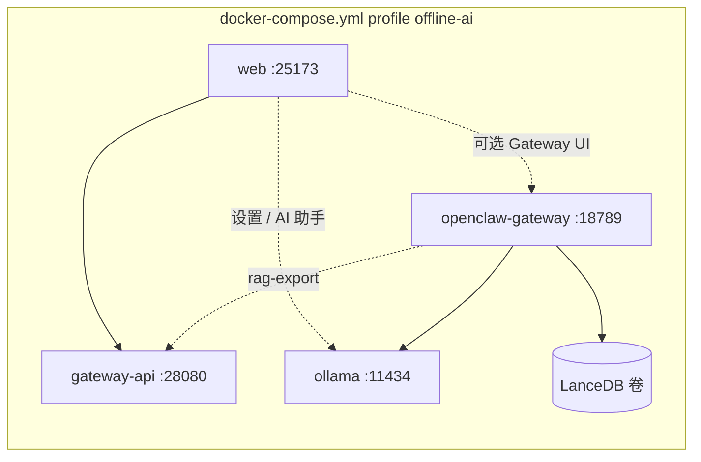
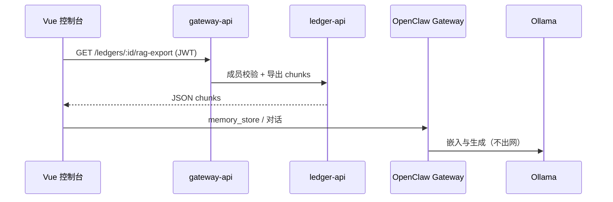

# OpenClaw 离线 AI 与账本 RAG（F34，可选 · 已弃用）

> **v0.19+**：AI 助手已迁移至 **ledger-api 内置 LangChainGo Agent**（`POST /api/v1/ai/chat`），默认 `make up` **不再**启动 OpenClaw Gateway。  
> 旧栈：`docker compose --profile openclaw-legacy up -d openclaw-gateway`

默认 AI 助手使用**云端 API**（DeepSeek 等），`make up` **不会**启动 Ollama。

若需完全离线 + OpenClaw RAG，使用 Compose profile **`offline-ai`**：

```bash
make offline-ai-up
```

将：

1. 初始化 `data/openclaw/config/openclaw.json` 与 `.env.openclaw`（含 Gateway token）
2. 启动 **Ollama**（`:11434`）与 **OpenClaw Gateway**（`:18789`）
3. 首次通过 `ollama-init` 拉取 `llama3.2`、`nomic-embed-text`（数 GB 磁盘，可在 `.env.openclaw` 修改）

控制台：**设置 → AI** → 选择 **Ollama（本地离线）** → 参阅「离线使用须知」→ **AI 助手** 页对话。

OpenClaw Control UI：http://127.0.0.1:18789（需 `make offline-ai-up`；token 见 `.env.openclaw`）。

---

## 架构



| 组件 | 说明 |
|------|------|
| `ollama` | 本地对话与向量模型（profile `offline-ai`，容器内 `http://ollama:11434`） |
| `openclaw-gateway` | AI Gateway + memory-lancedb |
| `data/openclaw/config` | `openclaw.json`、状态（持久化，gitignore） |
| `data/openclaw/lancedb` | 向量库目录 |

---

## 控制台 AI 设置

**云端（默认）**：**设置 → AI** → 选 DeepSeek 等 → 填写 **API Key** → 启用。

**离线（可选）**：选 **Ollama（本地离线）** 或 **LM Studio**，按页面「离线使用须知」部署；Docker 用户执行 `make offline-ai-up`。

| 项 | 离线 Docker 典型值 |
|----|---------------------|
| API 地址 | `http://127.0.0.1:11434/v1` |
| 对话模型 | `llama3.2` |
| OpenClaw Gateway | `http://127.0.0.1:18789`（RAG 高级功能） |

---

## 环境变量（`.env.openclaw`）

`make offline-ai-up` 会通过 `scripts/init-openclaw-config.*` 自动从 [`.env.openclaw.example`](../.env.openclaw.example) 创建。

| 变量 | 默认 | 说明 |
|------|------|------|
| `OPENCLAW_IMAGE` | `ghcr.io/openclaw/openclaw:latest` | 官方预构建镜像 |
| `OPENCLAW_GATEWAY_TOKEN` | （脚本生成） | Control UI 鉴权 |
| `OLLAMA_CHAT_MODEL` | `llama3.2` | 对话模型（`ollama-init` 拉取） |
| `OLLAMA_EMBED_MODEL` | `nomic-embed-text` | OpenClaw LanceDB 嵌入模型 |
| `SMART_LEDGER_GATEWAY` | `http://gateway-api:28080` | 容器内访问账本网关 |

### 常用命令

```bash
make offline-ai-up
make offline-ai-logs
make offline-ai-down
docker compose --profile offline-ai --env-file .env.openclaw logs -f openclaw-gateway ollama
```

OpenClaw CLI（可选）：

```bash
docker compose --profile offline-ai --env-file .env.openclaw --profile cli run --rm openclaw-cli status
```

### 本地构建镜像（可选）

若需自定义插件或 fork 源码：

```bash
./scripts/setup-openclaw.sh   # 克隆 openclaw/ 到项目根
# .env.openclaw 中设置 OPENCLAW_IMAGE=openclaw:local
cd openclaw && docker build -t openclaw:local -f Dockerfile .
docker compose --profile offline-ai --env-file ../.env.openclaw up -d openclaw-gateway
```

参考上游：[OpenClaw Docker 文档](https://docs.openclaw.ai/install/docker)。

---

## 宿主机安装 OpenClaw 源码（开发，可选）

适合频繁改 OpenClaw 源码的场景；Gateway 不在 Docker 内。

```powershell
# Windows
.\scripts\setup-openclaw.ps1
cd openclaw
pnpm install
pnpm openclaw onboard --install-daemon
```

```bash
# Linux / macOS
./scripts/setup-openclaw.sh
cd openclaw && pnpm install && pnpm openclaw onboard --install-daemon
```

合并 [`integrations/openclaw/openclaw.example.json`](../integrations/openclaw/openclaw.example.json) 到 `openclaw/openclaw.json`。Ollama 仍可由 Docker 提供：

```bash
make offline-ai-up
# 或仅 ollama：
docker compose --profile offline-ai --env-file .env.openclaw up -d ollama
```

---

## 账本 RAG 数据流



- API：`GET /api/v1/ledgers/:id/rag-export`（仅账本成员）。
- 脚本：[`integrations/openclaw/scripts/index-ledger-rag.ps1`](../integrations/openclaw/scripts/index-ledger-rag.ps1)。
- Agent：[`integrations/openclaw/workspace-smart-ledger/AGENTS.md`](../integrations/openclaw/workspace-smart-ledger/AGENTS.md)。

**Docker 内拉取 RAG**（OpenClaw 容器访问同栈 gateway）：

```bash
curl -s -H "Authorization: Bearer $ACCESS_TOKEN" \
  "${SMART_LEDGER_GATEWAY:-http://gateway-api:28080}/api/v1/ledgers/LEDGER_ID/rag-export"
```

---

## 安全提示

- Gateway 默认发布 `127.0.0.1:18789`，勿在未加固情况下对公网暴露。
- 务必设置强 `OPENCLAW_GATEWAY_TOKEN`。
- 云端 API Key 仅存浏览器 localStorage，经网关代理转发；离线账本数据默认留在本机 Ollama / LanceDB。
