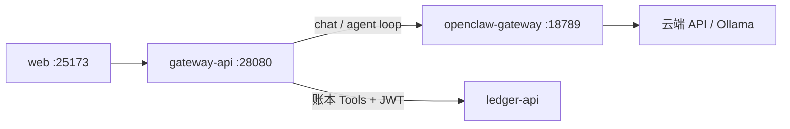

# OpenClaw 与 Smart Ledger AI

> **当前架构（Go 栈）**：控制台 → `gateway-api` → **OpenClaw Gateway**（`:18789`）→ 模型。  
> 账本 Tool Calling 由 **gateway 内置编排**（用户 JWT → ledger-api）。  
> **已移除**：`py-backend` / Python `ai-api`。

```bash
make up                 # 含 OpenClaw Gateway
make offline-ai-up      # 额外拉起 Ollama
```

控制台：**设置 → AI** → 提供方/模型 →（可选）Gateway URL/Token → **测试连接** → **AI 助手**。

OpenClaw Control UI：http://127.0.0.1:18789

---

## 架构



| 组件 | 说明 |
|------|------|
| `gateway-api` | JWT、`/api/v1/ai/*`、OpenClaw 代理、工具循环、Agent 磁盘存储 |
| `openclaw-gateway` | Agent 推理核心（`/v1/chat/completions`） |
| `ollama` | 仅 `offline-ai` profile |

---

## 环境变量（gateway）

| 变量 | 默认 | 说明 |
|------|------|------|
| `OPENCLAW_GATEWAY_URL` | `http://openclaw-gateway:18789` | Gateway 根地址 |
| `OPENCLAW_GATEWAY_TOKEN` | （空） | Bearer Token |
| `OPENCLAW_AGENT_MODEL` | `openclaw/default` | 请求体 `model` |
| `AGENT_CONFIG_PATH` | `/data/agent/config` | Agent 工作区/历史 |
| `LEDGER_API_URL` | `http://ledger-api:28888` | 工具调用 |

### 账本 API

`useTools: true` 时 gateway 暴露 `call_ledger_api` 等工具；策略见 `go-backend/services/gateway/internal/ai/policy.go`。  
技能：`integrations/openclaw/workspace-smart-ledger/skills/smart-ledger-api/`。

### DeepSeek / 云端 API Key

容器挂载的是 **`deploy/config/openclaw`**（不是 `data/openclaw`）。需同时具备：

1. `openclaw.json` 里 `models.providers.deepseek.apiKey`
2. `agents/main/agent/auth-profiles.json`（`repair-openclaw-config.js` / `openclaw-auth-sync.js` 会生成）

```bash
# 编辑 deploy/config/openclaw/openclaw.json 填入 apiKey 后：
node scripts/repair-openclaw-config.js deploy/config/openclaw/openclaw.json
docker compose -p smart-ledger-go --project-directory . -f deploy/compose/docker-compose.yml restart openclaw-gateway
```

若本地 `data/openclaw/config` 已有 Key，`make init-openclaw-config` 会自动播种到 deploy 目录。

### 常用命令

```bash
make openclaw-logs
docker compose -p smart-ledger-go --project-directory . -f deploy/compose/docker-compose.yml logs -f openclaw-gateway gateway-api
```

参考上游：[OpenClaw Docker 文档](https://docs.openclaw.ai/install/docker)。
